# Lecture 2 - N-Gram & Word2Vec Models

## N-Gram 모델

### 언어 모델의 정의 (Definition of a Language Model)

언어 모델은 **다가올 단어를 예측**하는 머신러닝 모델이다

- LM은 가능한 각 다음 단어에 확률을 할당한다
- = 가능한 다음 단어들에 대한 **확률 분포**(probability distribution)을 제공한다

**예시**

- The water of Walden Pond is beautifully ...
- 가능함(Possibly) : blue, green, clear, ...
- 아마도 아님(Probably not) : refrigerator, that, ...

---

### 왜 단어 예측인가? (Why Word Prediction?)

**문법 또는 철자 검사**

- **Their** are two midterms → **There** are two midterms
- Everything has **improve** → Everything has **improved**

**음성 인식**

- I will be back soonish / I will be bassoon dish

---

### 언어 모델의 형식적 목표 (Formal Goal of LM)

문장 또는 단어 시퀀스 W의 확률을 계산한다

- $P(W) = P(w_1, w_2, w_3, w_4, w_5, \dots, w_n)$

다가올 단어의 확률을 계산한다

- $P(w_5 / w_1, w_2, w_3, w_4)$ 또는 $P(w_n / w_1, w_2, \dots, w_{n-1})$

모든 문장에 확률을 할당하는 것은 문제가 있다.

- 단어 시퀀스의 집합은 무한하다.

> 참고: 지금은 이것들을 단어(words)라고 부르지만, LLM에서는 대신 토큰(tokens)을 사용한다

---

### 단순한 확률 추정 (Trivial Probability Estimation)

세고 나누기 (Count and divide)

$$P\left(\frac{blue}{The\ water\ of\ Walden\ Pond\ is\ so\ beautifully}\right) = \frac{C(The\ water\ of\ Walden\ Pond\ is\ so\ beautifully\ blue)}{C(The\ water\ of\ Walden\ Pond\ is\ so\ beautifully)}$$

모든 문장에 확률을 할당하는 것은 문제가 있다.

- 가능한 문장이 너무 많다
- 이것들을 추정하기에 충분한 데이터를 결코 보지 못할 것이다.

> 이것이 N-gram LM의 동기가 된다

---

### P(W)를 계산하기 위한 수학적 접근 (Mathematical Approach to Compute P(W))

결합 확률 P(W)를 찾기 위해

$$P(The, water, of, Walden, Pond, is, so, beautifully, blue) = ?$$

확률의 연쇄 법칙(Chain Rule of Probability)에 의존해 보자

---

### 복습 : 연쇄 법칙 (Recall : The Chain Rule)

조건부 확률(Conditional Probability)

$$P(E/F) = \frac{P(EF)}{P(F)}$$

$$P(EF) = P(F)P(E/F)$$

일반적으로,

$$P(E_1 E_2 \cdots E_n) = P(E_1)P(E_2/E_1)P(E_3/E_1E_2) \cdots P(E_n/E_1E_2\cdots E_{n-1})$$

> 이것이 N-gram LM의 동기가 된다

---

### P(W)를 계산하기 위한 수학적 접근 (Mathematical Approach to Compute P(W))

결합 확률(joint probability) P(W)를 찾기 위해

$$P(w_1w_2\cdots w_n) = P(w_{1:n}) = P(w_1)P(w_2/w_1)P(w_3/w_1w_2)\cdots P(w_n/w_1w_2\cdots w_{n-1}) = \prod_{k=1}^{n} P(w_k/w_{1:k-1})$$

- 따라서, 문장 "The water of Walden Pond"의 확률은 다음과 같이 계산할 수 있다 :

```
P("The water of Walden Pond") =
P(The) × P(water|The) × P(of|The water)
      × P(Walden|The water of) × P(Pond|The water of Walden)
```

하지만 너무 복잡하다...

---

### 마르코프 가정 (Markov Assumption)

$$P(w_n/w_{1:n-1}) \approx P(w_n/w_{n-1})$$

- 이제 앞의 질문에 답할 수 있다 :

$$P(blue/The, water, of, Walden, Pond, is, so, beautifully) \approx P(blue/beautifully)$$

- 예시 : Shakespeare **bigram** 모델로 자동 생성된 문장

> Why dost stand forth thy canopy, forsooth; he is this palpable hit the King Henry. Live king. Follow.
>
> What means, sir. I confess she? then all sorts, he is trim, captain.

이것을 **bigram** 마르코프 가정이라고 부른다.

이제 추정이 쉬워진다.

---

### N-gram 마르코프 가정 (N-gram Markov Assumption)

$$P(w_n/w_{1:n-1}) \approx P(w_n/w_{n-N+1:n-1})$$

- Trigram 모델:

$$P(w_n/w_{1:n-1}) \approx P(w_n/w_{n-1}w_{n-2})$$

- 예시 : Shakespeare trigram 모델로 자동 생성된 문장

> Fly, and will rid me these news of price. Therefore the sadness of parting, as they say, 'tis done.
>
> This shall forbid it should be branded, if renown made it empty.

---

### N-gram 모델의 문제점 (Problems with N-gram models)

- 장거리 의존성(long-distance dependencies)을 처리할 수 없다

  "**The soups** that I made from that new cookbook I bought yesterday **were** amazingly delicious."

- 새로운 시퀀스를 모델링하는 데 좋지 않다
  (그들이 본 시퀀스와 유사한 의미를 가지고 있더라도)

그럼에도 불구하고, N-gram은 우리에게 다음을 알려준다

- 학습 세트와 테스트 세트(Training and test sets)
- Perplexity 지표
- 문장 생성을 위한 샘플링(Sampling)
- 보간(interpolation)과 백오프(backoff) 같은 아이디어

---

### 학습 세트와 테스트 세트 (Training and Test Sets)

N-gram 모델은 학습 데이터셋(Training dataset)으로부터 학습한 후, 다른 테스트 데이터셋(Test dataset)에서 성능을 평가하는 방식으로 구축된다.

- **학습 세트(Training set)**: 언어 패턴을 학습하는 데 사용된다.
- **테스트 세트(Test set)**: 모델이 새로운 문장을 예측할 수 있는지 확인하는 데 사용된다.

---

### Perplexity 지표 (Perplexity Metric)

Perplexity는 언어 모델이 문장을 볼 때 얼마나 놀라는지를 측정한다.

- 낮은 perplexity → 문장을 예측하기 쉽다.
- 높은 perplexity → 문장을 예측하기 어렵다.

주로 익숙하지 않은 언어일 때 놀란다.

Perplexity가 낮아야 좋다.

**예시**

- 모델이 "I like apples"를 확률 = 0.80으로 예측하면 → 낮은 perplexity.
- 모델이 "I like dinosaurs"를 확률 = 0.01로 예측하면 → 높은 perplexity.

---

### 생성을 위한 샘플링 (Sampling for Generation)

항상 가장 가능성 높은 다음 단어를 선택하는 대신, **모델은 확률에 따라 무작위로 샘플링할 수 있다.**

- 이것은 생성된 텍스트를 더 자연스럽고 다양하게 만든다.

**예시**

- "I like" 다음에 모델이 다음과 같이 예측한다고 가정하자

| 단어(Word) | 확률(Probability) |
|---|---|
| apples | 60% |
| bananas | 30% |
| pizza | 10% |

- 모델이 항상 가장 높은 확률을 선택한다면, 매번 "I like apples"가 생성된다.
- 샘플링을 사용하면, 가능한 출력은 "I like apples", "I like bananas" 또는 "I like pizza"가 된다.

---

### 백오프 & 보간 기법 (Backoff & Interpolation Technique)

때때로 모델은 특정 N-gram을 본 적이 없다. 확률을 어떻게 추정해야 할까?

- **백오프(Backoff)** : trigram이 없으면 bigram을 사용한다. bigram도 없으면 unigram을 사용한다.
- **보간(Interpolation)** : 하나의 모델만 선택하는 대신, 보간은 여러 모델을 결합한다.

**백오프 예시**

- "I drink coffee"를 원한다고 가정하자.
- 모델이 trigram을 시도한다 : P(coffee / I drink) → 찾을 수 없음.
- 모델이 bigram을 시도한다 : P(coffee / drink) → 찾을 수 없음.
- 모델이 unigram을 시도한다 : P(coffee) → 이 확률을 사용한다.

**보간 예시**

* `"I drink coffee"`를 예측한다고 가정하자.

* 보간은 trigram, bigram, unigram 중 하나만 선택하지 않고 **세 확률을 모두 함께 사용한다.**

* trigram 확률: \(P(coffee \mid I\ drink) = 0.6\)

* bigram 확률: \(P(coffee \mid drink) = 0.4\)

* unigram 확률: \(P(coffee) = 0.1\)

각 모델에 가중치를 준다고 하자.

* trigram 가중치: 0.5
* bigram 가중치: 0.3
* unigram 가중치: 0.2

그러면 최종 확률은

$$
P(coffee \mid I\ drink)
= 0.5(0.6) + 0.3(0.4) + 0.2(0.1)
= 0.44
$$

즉, **백오프는 높은 차수의 모델을 사용할 수 없을 때 낮은 차수로 내려가는 방식**이고, **보간은 여러 차수의 모델 확률을 가중합해서 항상 함께 사용하는 방식**이다.


---

### 백오프 예시 (Backoff Example)

**학습 코퍼스(Training corpus)**

- I eat pizza, I eat apples, You eat pizza, You like apples (4개 문장)

<p align="center">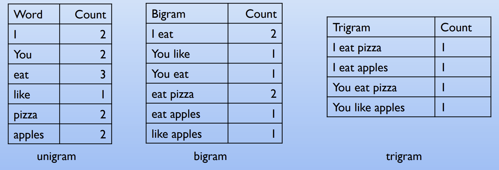</p>

---

**다음 단어 예측**

- I eat ____.
- Trigram : P(next word / I eat) → P(pizza / I eat) = 0.5, P(apples / I eat) = 0.5
- 모든 것이 완벽하게 작동한다.

**다음 단어 예측**

- You enjoy ____.
- Trigram : P(word / You enjoy) = 0 → Bigram : P(word / enjoy) = 0
- 모델이 예측할 수 없다.
- Unigram : P(eat)이 가장 높다.
- 모델은 "You enjoy eat"을 생성할 수 있다

---

### 보간 예시 (Interpolation Example)

**다음 단어 예측**

- I eat ____.
- 후보 "pizza"에 대해, 확률은 다음과 같다
- Trigram : P(pizza / I eat) = 1/2 , Bigram : P(pizza / eat) = 2/3, Unigram P(pizza) = 1/6
- **가중치**는 각각 0.5, 0.3, 0.2이다.
- $P(pizza) = 0.5 \times \frac{1}{2} + 0.3 \times \frac{2}{3} + 0.2 \times \frac{1}{6} = 0.483$

---

### Bigram 구현 (Bigram Implementation)

**데이터셋 : Berkeley Restaurant Project**

- 발화가 짧고, 반복적이며, 도메인 특화적이기 때문에 특히 적합하다.
- 이 고전적인 말뭉치(corpus)는 9,222개의 레스토랑 질의 문장을 포함한다.

**예시**

- can you tell me about any good cantonese restaurants close by
- tell me about chez panisse
- i'm looking for a good place to eat breakfast
- when is caffe venezia open during the day

---

**원시 bigram 개수 (Raw bigram counts)**

- 9,222개의 레스토랑 질의 문장 중에서.

<p align="center">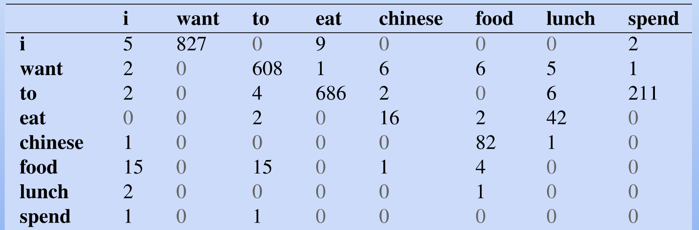</p>

---

**Unigram으로 정규화 (Normalize by Unigram)**

- 단어 세기(Count words)

<p align="center">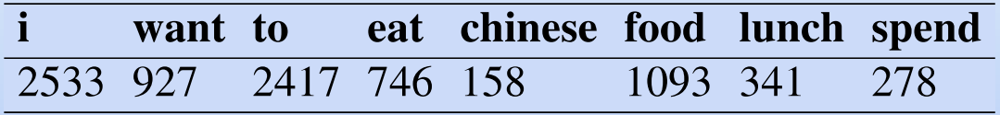</p>

- 결과 ($P(w_n/w_{n-1})$)

<p align="center">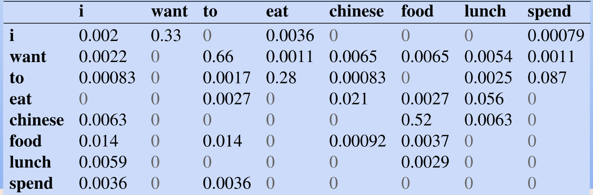</p>

---

**문장 확률 추정 (Estimating sentence probability)**

```
P(<s> I want english food </s>)
= P(I|<s>)
× P(want|I)
× P(english|want)
× P(food|english)
× P(</s>|food)
= .000031
```

많은 작은 수를 곱할 때 발생하는 언더플로(underflow)를 피하기 위해 **로그 확률(Log Probability)이 사용된다**

$$\log(p_1 \times p_2 \times p_3 \times p_4) = \log p_1 + \log p_2 + \log p_3 + \log p_4$$

우리는 확률을 원하므로,

$$p_1 \times p_2 \times p_3 \times p_4 = \exp(\log p_1 + \log p_2 + \log p_3 + \log p_4)$$


---

**문법에 대한 지식**

- "want"는 부정사 "to"가 뒤따른다
- "of"는 동사가 아니다

**확률로부터 지식 추정**

```
P(to|want) = .66
P(want | spend) = 0
P(of | to) = 0
P(dinner|lunch or) = .83
P(dinner|for) ~ P(lunch|for)
P(chinese|want) > P(english|want)
```

**의미에 대한 지식**

- "dinner" 또는 "lunch"라는 단어는 의미적으로 관련되어 있다.

**세상에 대한 지식**

- 중국 음식은 매우 인기가 있다

---

**로그 확률 (Log Probability)**

- 발화가 짧고, 반복적이며, 도메인 특화적이기 때문에 특히 적합하다.
- 이 고전적인 코퍼스는 9,222개의 레스토랑 질의 문장을 포함한다.

**예시**

- can you tell me about any good cantonese restaurants close by
- tell me about chez panisse
- i'm looking for a good place to eat breakfast
- when is caffe venezia open during the day

---

### 더 큰 N-gram (Larger N-grams)

큰 n-gram을 위한 대규모 데이터셋이 공개되어 왔다

- Corpus of Contemporary American English (COCA)의 N-gram, 10억 단어 (Davies 2020)
- Google Web 5-grams (Franz and Brants 2006), 1조 단어
- 효율성: 8바이트 float 대신 확률을 4-8비트로 양자화(quantize)한다
- 최신 모델: infini-grams (∞-grams) (Liu et al 2024)
- 사전 계산이 없다! 대신, 5조 단어의 웹 텍스트를 접미사 배열(suffix arrays)에 저장한다. 어떤 n에 대해서도 n-gram 확률을 계산할 수 있다!

---

### N-gram 모델 평가 (Evaluating N-gram Models)

**외재적(Extrinsic, in-vivo) 평가**

- 모델을 실제 과제에 넣고, 과제를 실행하고, 점수를 얻는다.

**예시**

1. 각 모델을 실제 과제에 넣는다
   - 기계 번역(Machine Translation), 음성 인식 등.
2. 과제를 실행하고, A와 B에 대한 점수를 얻는다
   - 몇 개의 단어가 정확하게 번역되었는가
   - 몇 개의 단어가 정확하게 전사(transcribe)되었는가
3. A와 B의 정확도를 비교한다

---

**외재적 평가가 항상 가능한 것은 아니다**

- 비용이 많이 들고, 시간이 오래 걸리며, 사람의 채점이 필요하다
- 다른 응용으로 항상 일반화되지는 않는다

**내재적(Intrinsic) 평가 (perplexity)**

- 단어 예측에서의 언어 모델 성능을 직접 측정한다.
- 실제 응용 성능과 반드시 일치하지는 않는다
- 하지만 언어 모델에 대한 하나의 일반적인 지표를 제공한다
- n-gram뿐만 아니라 LLM에도 유용하다

---

### Perplexity

**직관 : 좋은 LM은 더 높은 확률을 할당한다**

- 실제 문장 또는 자주 관찰되는 문장에,
- 실제로 나타나는 다음 단어에,
- 전체 테스트 세트에.
- 그리고 텍스트가 길어질수록 확률은 작아진다.
  → 지표는 단어별(per-word)이며, 길이로 정규화된다

**Perplexity**

- 테스트 세트의 역확률(inverse probability)을 단어 수로 정규화한 것.

$$PP(W) = P(w_1w_2\cdots w_N)^{-\frac{1}{N}} = \sqrt[N]{\frac{1}{P(w_1w_2\cdots w_N)}}$$

- 확률 범위 : [0,1]
- Perplexity 범위 : [1, ∞]
- perplexity를 최소화하는 것은 확률을 최대화하는 것과 같다

---

### N-gram의 Perplexity (Perplexity of N-grams)

**연쇄 법칙(Chain rule)**

$$PP(W) = \sqrt[N]{\prod_{i=1}^{N} \frac{1}{P(w_i/w_1, w_2, \dots, w_{i-1})}}$$

**Bigram**

$$PP(W) = \sqrt[N]{\prod_{i=1}^{N} \frac{1}{P(w_i/w_{i-1})}}$$

**예시 :**
학습 3천만 단어,
WSJ(Wall Street Journal)에서 테스트 150만 단어

- Unigram : 962
- Bigram : 170
- Trigram : 109

---

### 분포에서 단어 샘플링하기 (Sampling a Word from Distribution)

**Unigram의 경우**

- 모든 단어가 0과 1 사이의 확률 공간을 덮고 있다.
- 0과 1 사이의 무작위 값을 선택한다.
- 확률 선(probability line)에서 그 지점을 찾고, 대응하는 단어를 찾는다

<p align="center">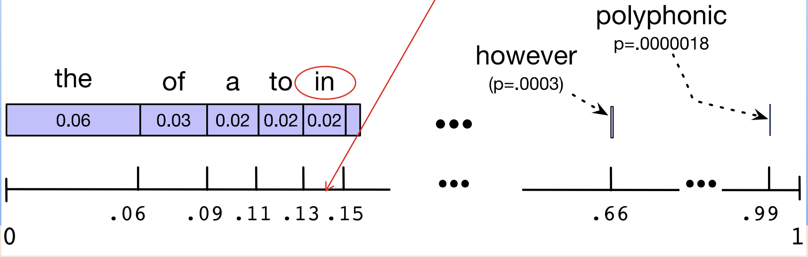</p>

---

**Bigram의 경우**

- 확률 p(w|\<s>)에 따라 무작위 bigram (\<s>, w)를 선택한다
- 이제 확률 p(x|w)에 따라 무작위 bigram (w, x)를 선택한다
- 그리고 \</s>를 선택할 때까지 계속한다
- 그런 다음 단어들을 이어 붙인다

<p align="center">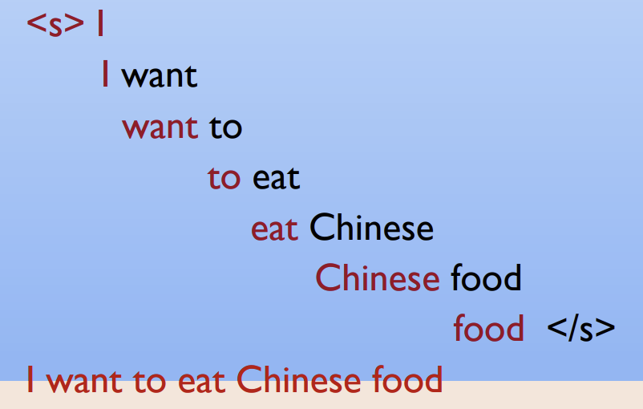</p>

---

### N-gram 언어 모델 vs. LLM

**단순한 n-gram 언어 모델**

- 단어 시퀀스에 확률을 할당한다
- 가능한 다음 단어를 샘플링하여 텍스트를 생성한다
- 많은 텍스트로부터 계산된 개수(counts)로 학습된다

**대규모 언어 모델은 유사하면서도 다르다**

- 단어 시퀀스에 확률을 할당한다
- 가능한 다음 단어를 샘플링하여 텍스트를 생성한다
- 다음 단어를 추측하는 것을 학습함으로써 훈련된다

---

## Word2Vec 모델

### N-gram의 문제점 (Problems of N-gram)

1. 데이터 희소성(Data sparsity) → 워드 임베딩(Word Embedding)
2. 고정된 문맥 윈도우(Fixed context window) → RNN/LSTM
3. 장거리 의존성(Long-range dependency) → 어텐션(Attention)
4. 순차적 계산 병목(Sequential computation bottleneck) → 트랜스포머(Transformer)
5. 대규모 사전학습(Large-scale pretraining) → LLM

---

### Word2Vec (이산 공간에서 연속 공간으로, From discrete to continuous space)

**단어 의미의 전통적인 표현**

- **사전(Dictionary)** : 계산 언어학 연구에서 그다지 유용하지 않다.

- **WordNet** : "is-a", 동의어 집합(synonym sets) 같은 관계를 가진 단어 그래프.
  - **문제점**: 사람의 라벨링에 의존하므로 많은 것을 놓치고, 이 과정을 자동화하기 어렵다

- **원자적 기호(Atomic symbols)** : one-hot 벡터, 매우 길다 (일상 대화 20K, 기계 번역 50K)

  ```
  Hotel: [0,0,0,0,0,0,0,0,1,0,0,0,0,0]
  Motel: [0,0,0,0,1,0,0,0,0,0,0,0,0,0]
  ```

  - **문제점**: 유사성의 자연스러운 의미가 없다 ($hotel \cdot motel^T = 0$)

---

### WordNet 예시 (WordNet Example)

<p align="center">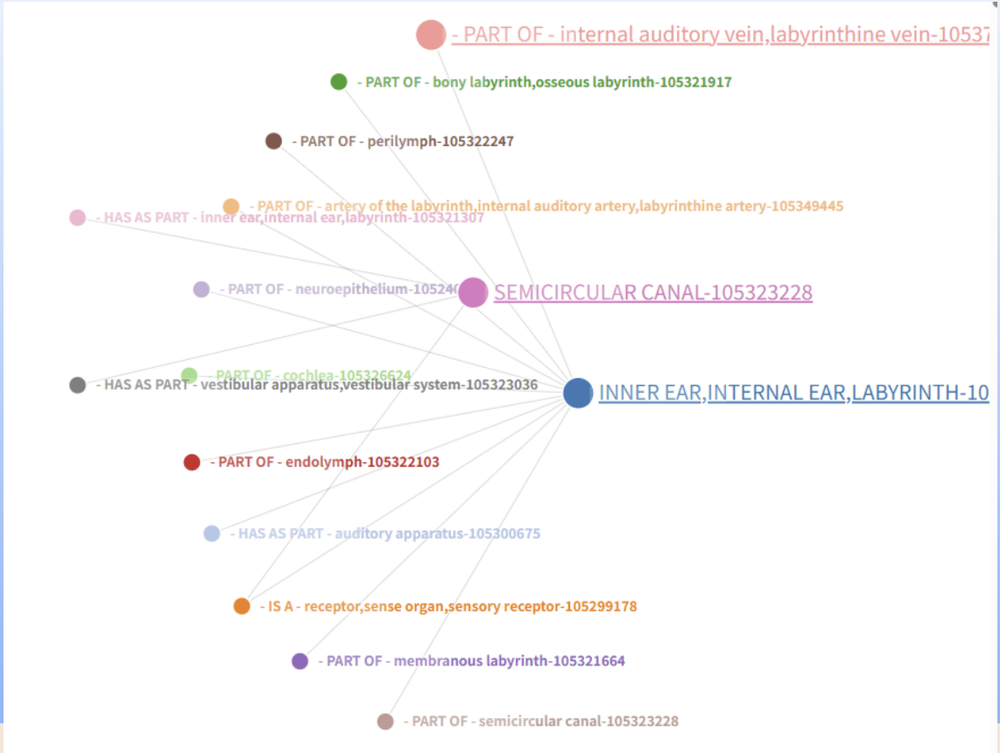</p>

---

이 문제를 어떻게 해결할까? 뉴턴과 라이프니츠가 미적분학에서 한 것에서 영감을 얻었다.

직사각형의 개수 → ∞ 일 때

<p align="center">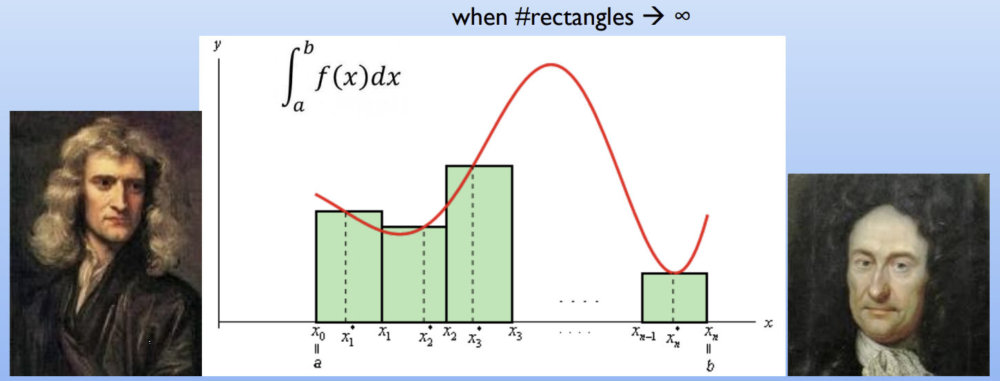</p>

---

**단어의 의미를 표현하는 두 가지 접근법**

1. 많은 "직사각형", 즉 숫자의 벡터를 사용하여 단어의 의미를 근사적으로 표현한다.
2. 무엇이 단어의 의미를 표현하는가?

   "You shall know a word by the company it keeps" - J.R. Firth, 1957

따라서, 우리의 목표는 각 단어에 벡터를 할당하여 유사한 단어가 유사한 벡터를 갖게 하는 것이다 (내적, dot-product 기준).

우리는 JR Firth를 믿고 신경망을 사용해 (저차원) 벡터를 학습시킬 것이다. 두 단어가 텍스트에서 매번 함께 나타나면, 그들은 조금씩 더 가까워져야 한다.

이것은 **주석(annotation) 없이 대규모 코퍼스**를 사용할 수 있게 해준다! 따라서, 우리는 한 번에 2d+1 크기의 윈도우를 보면서 학습 데이터를 스캔할 것이다. 중심 단어(center word)가 주어지면, 왼쪽 d개 단어와 오른쪽 d개 단어를 예측하려고 시도한다.

---

**신경망 설계하기 - 정의**

중심 단어 $w_t$와 문맥 단어 $w_{t'} = w_{t-2}, w_{t-1}, w_{t+1}, w_{t+2}$에 대해, 어떤 고정된 크기의 윈도우 내에서 (이 예시에서는 2)

우리는 $p(w_t'/w_t)$를 최대화하거나, 손실 함수 $L = 1 - p(w_t'/w_t)$를 최소화하기 위해 모든 $w_t$를 예측하는 신경망을 만들고자 한다.

따라서 큰 코퍼스의 많은 위치를 보면서, 이 손실을 최소화하기 위해 이 벡터들을 계속 조정하면, 각 단어 의미의 (저차원) 벡터 근사에 도달한다. 두 단어가 가까운 위치에 자주 나타나면 우리는 그들을 유사하다고 간주한다는 의미에서다.

---

**신경망 설계하기 - 손실 함수**

$$L(\theta) = 1 - p(w_t'/w_t) = 1 - \prod_{t=1..T} \prod_{d=-2,-1,1,2} p(w_{t+d}/w_t, \theta)$$

여기서 $\theta$는 우리가 최적화하는 모든 변수(즉, 벡터)이고 T = |training text|이다.

로그를 취하고 평균을 내면,

$$L(\theta) = -\frac{1}{T} \sum_{t=1..T} \sum_{d=-2,-1,1,2} \log p(w_{t+d}/w_t)$$

$p(w_{t+c}/w_t)$는 점수(내적)의 softmax로 근사할 수 있다

$$L(\theta) \approx -\frac{1}{T} \sum_{t=1..T} \sum_{d=-2,-1,1,2} \log softmax(v_{t+d} \cdot v_t)$$

---

**신경망 설계하기 - 네거티브 샘플링 (Negative sampling)**

중심 단어 c와 문맥/외부 단어 o의 softmax

$$softmax(v_o \cdot v_c) = \frac{e^{(v_o \cdot v_c)}}{\sum_{k=1..V} e^{(v_k \cdot v_c)}}, \quad V = \text{사전의 크기}$$

매번 $\sum_{k=1..V} e^{(v_k \cdot v_c)}$를 계산해야 하는데, 이것은 너무 비싸다.

네거티브 샘플링 :

---

**skip-gram 모델** (Estimation of Word Representation in vector space, 2013)

- 어휘 크기(Vocabulary size) : V
- 입력층(Input layer) : one-hot 벡터로 표현된 중심 단어
- $W_{V \times N}$의 k번째 행은 k번째 단어의 중심 벡터(center vector)이다.
- $W'_{N \times V}$의 k번째 열은 V에 있는 k번째 단어의 문맥 벡터(context vector)이다. 각 단어는 2개의 벡터를 가지며, 둘 다 무작위로 초기화된다.
- 출력 열 $y_{ij}$, i=1..D는 3단계를 갖는다.
  1. 문맥 단어 one-hot 벡터를 사용하여 $W'_{V \times N}$에서 해당 열을 선택한다.
  2. 중심 단어인 $h_i$와 내적한다
  3. softmax를 계산한다

<p align="center">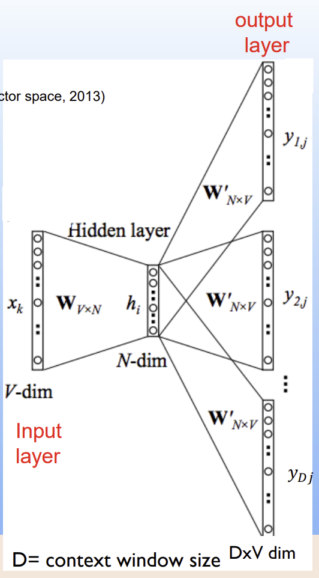</p>

---

**skip-gram 모델 - 학습 데이터셋 만들기 (Making training dataset)**

사용 가능한 텍스트 : Thou shalt not make a machine in the likeness of a human mind. ... (기존의 연속 텍스트에서)

<p align="center">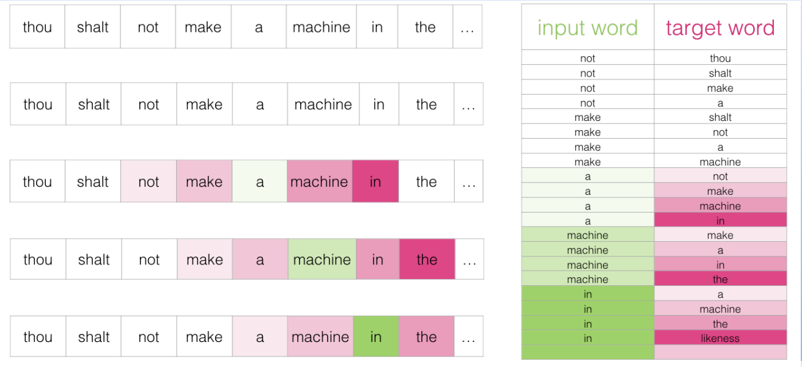</p>

---

**skip-gram 모델 - softmax 계산 (Calculate the softmax)**

입력 단어로부터, 목표 단어를 예측한다.

<p align="center">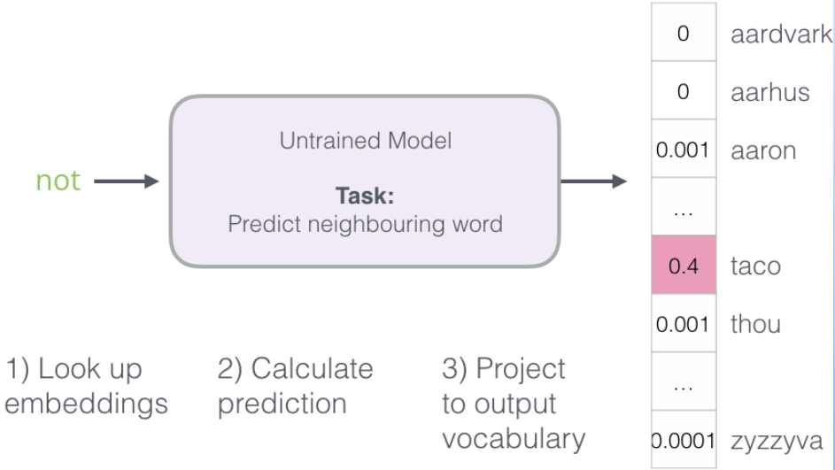</p>

---

**skip-gram 모델 - 손실 계산 (Calculate the loss)**

손실(오차)을 계산한 다음 모델 파라미터를 업데이트한다.

<p align="center">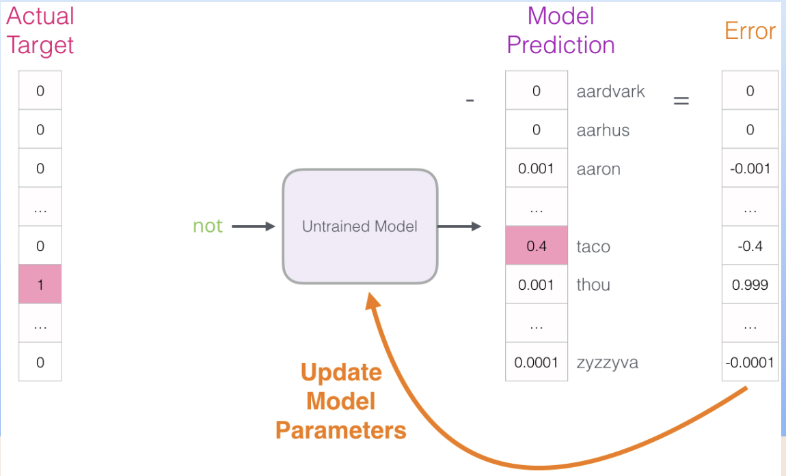</p>

---

**skip-gram 모델 - 네거티브 샘플링 (Negative sampling)**

문제는 학습 속도다!!

<p align="center">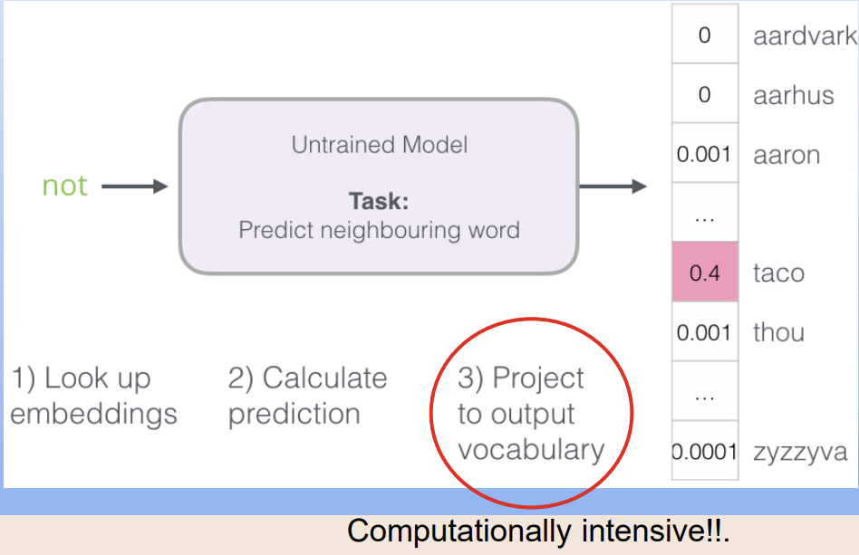</p>

계산적으로 매우 집약적이다!!

---

<p align="center">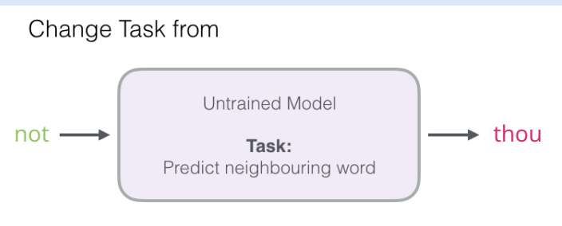</p>

<p align="center">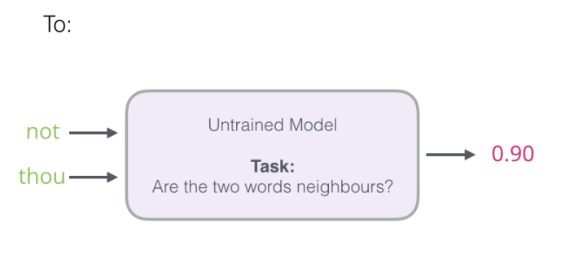</p>

---

데이터셋을 수정해야 한다.

<p align="center">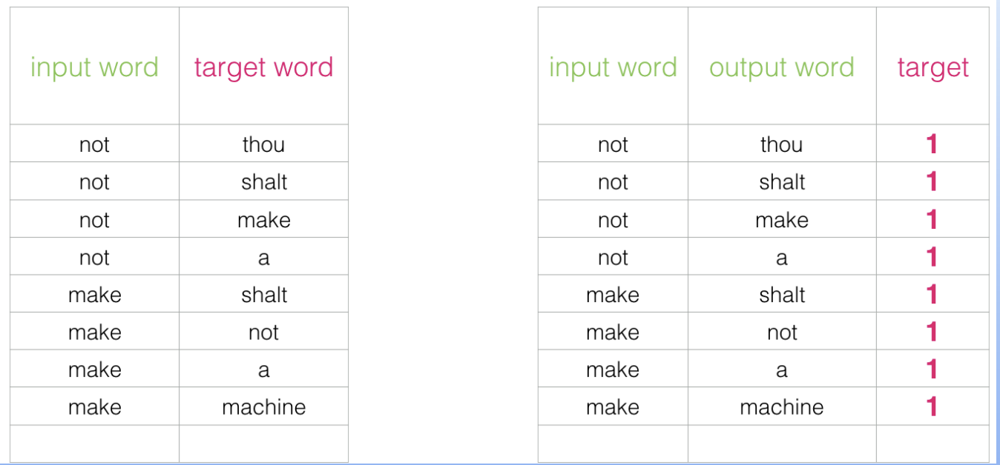</p>

---

이 데이터셋으로는, 항상 1을 반환하는 얄미운(smart ass) 모델이 존재한다.

<p align="center">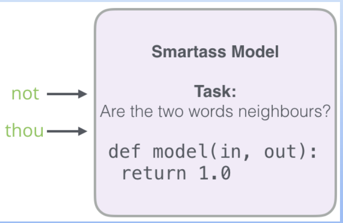</p>

> 모두 1을 반환하면 모델은 아무런 학습도 하지 않는다.

---

이를 해결하기 위해, 데이터셋에 **네거티브 샘플(negative samples)** 을 도입해야 한다.

어휘에서 무작위로 선택한다 (무작위 샘플링, random sampling)

<p align="center">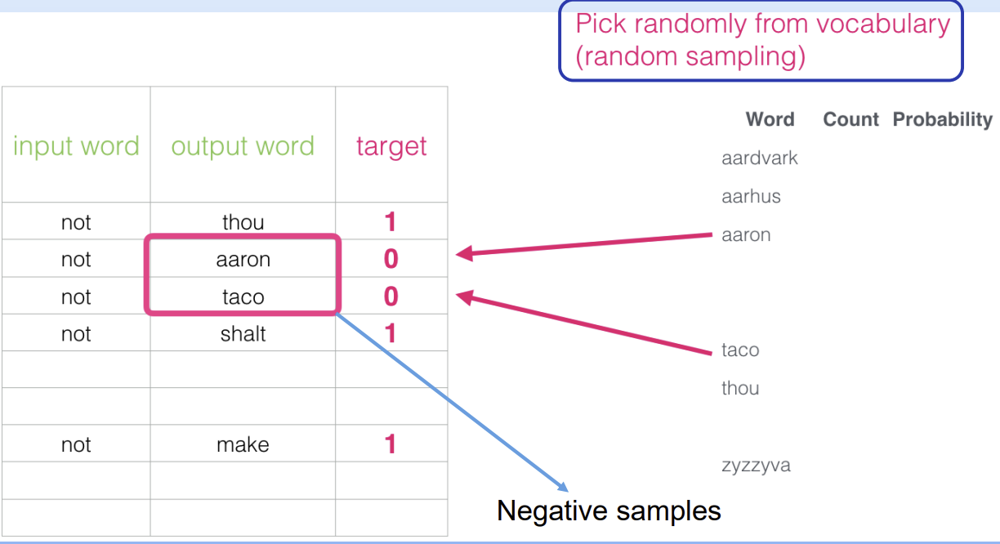</p>

---

**학습 과정 (The training process) - 전처리 (Pre-process)**

1. 어휘의 크기(예: vocab_size, 10,000)와 그 안의 단어들을 결정한다.
2. 임베딩의 크기(예: embedding_size, 300)를 결정한다.
3. 무작위로 초기화된 두 개의 행렬, 임베딩(Embedding) 행렬과 문맥(Context) 행렬을 준비한다.

<p align="center">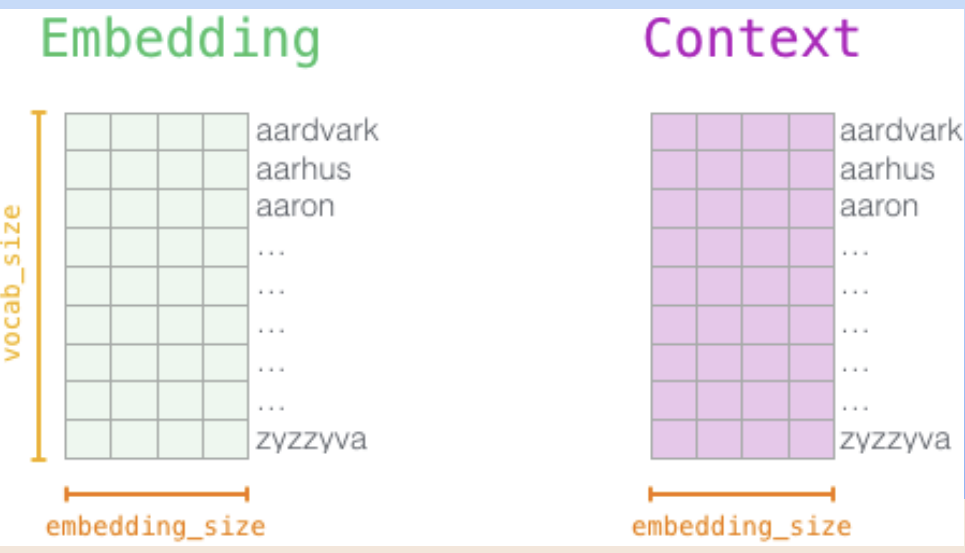</p>

---

**학습 과정 (The training process) - 학습 (training)**

1. 각 학습 단계에서, 하나의 긍정 예시(positive example)와 그에 연관된 부정 예시(negative examples)를 취한다.
2. 우리는 네 개의 단어를 가진다
   - 입력 단어(The input word) : not
   - 출력/문맥 단어(The output/context words) : thou (실제 이웃), aaron, taco (네거티브 예시)

<p align="center">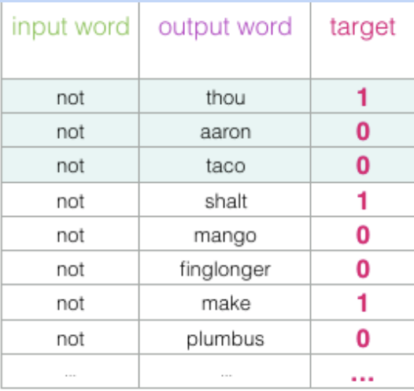</p>

---

1. 임베딩을 조회한다(Look up their embeddings)
   - 입력 단어에 대해 - 임베딩 행렬(the embedding matrix)
   - 문맥 단어에 대해 - 문맥 행렬(the context matrix)

<p align="center">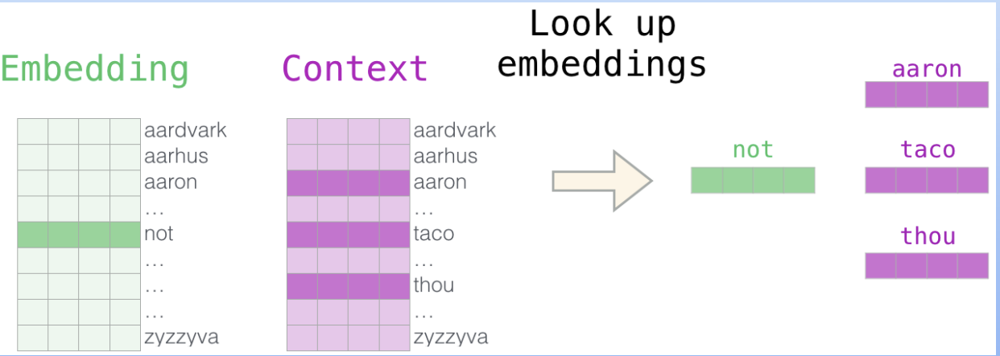</p>

---

1. 입력 임베딩과 각 문맥 임베딩의 내적을 취한다.
2. 시그모이드(sigmoid) 함수를 사용하여 점수를 확률로 변환한다.
3. 오차를 계산한다 (= target - sigmoid_scores)

<p align="center">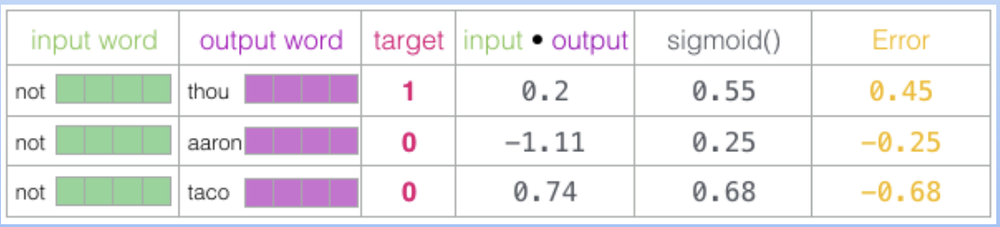</p>

---

1. 모델 파라미터를 업데이트한다.
2. 다음 긍정 샘플과 그에 연관된 네거티브 샘플로 진행한다.
3. 같은 과정을 다시 수행한다.

<p align="center">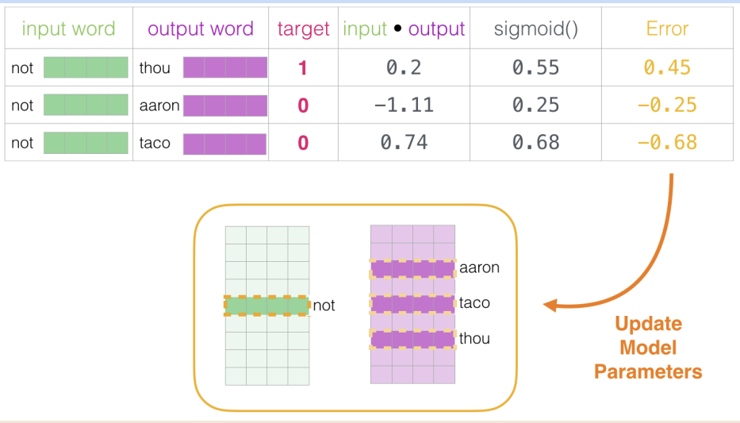</p>

---

**학습 과정 (The training process) - 윈도우 크기 & 네거티브 샘플 크기**

- 과제가 다르면 더 잘 맞는 윈도우 크기도 다르다
  - 작은 크기 (2 ~ 15) : 높은 유사도는 단어들이 **상호 교환 가능(interchangeable)** 하다는 것을 나타낸다.
  - 큰 크기 (15 ~ 50) : 높은 유사도는 단어들의 **관련성(relatedness)** 을 나타낸다.
- 네거티브 샘플의 수 : 5~20이 좋은 숫자다.

<p align="center">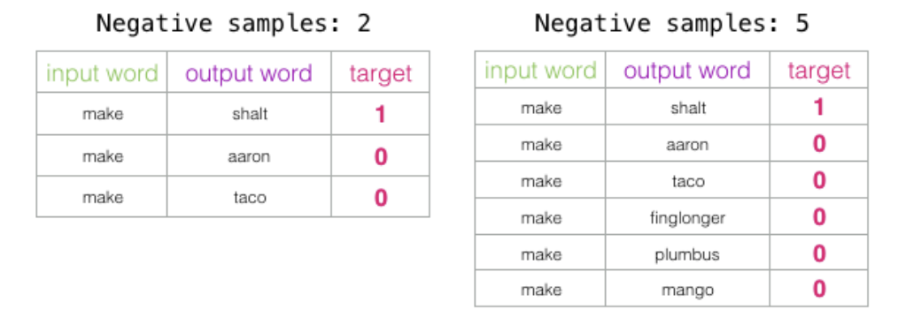</p>

---

**결과 (The Results)**

<p align="center">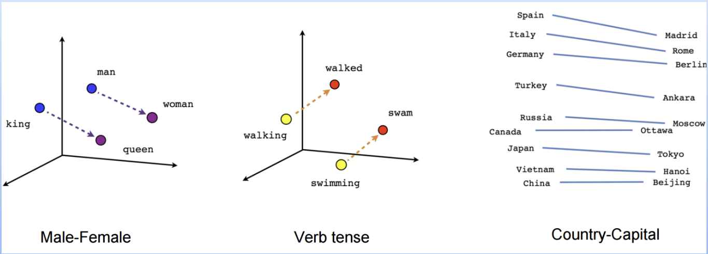</p>

---

<p align="center">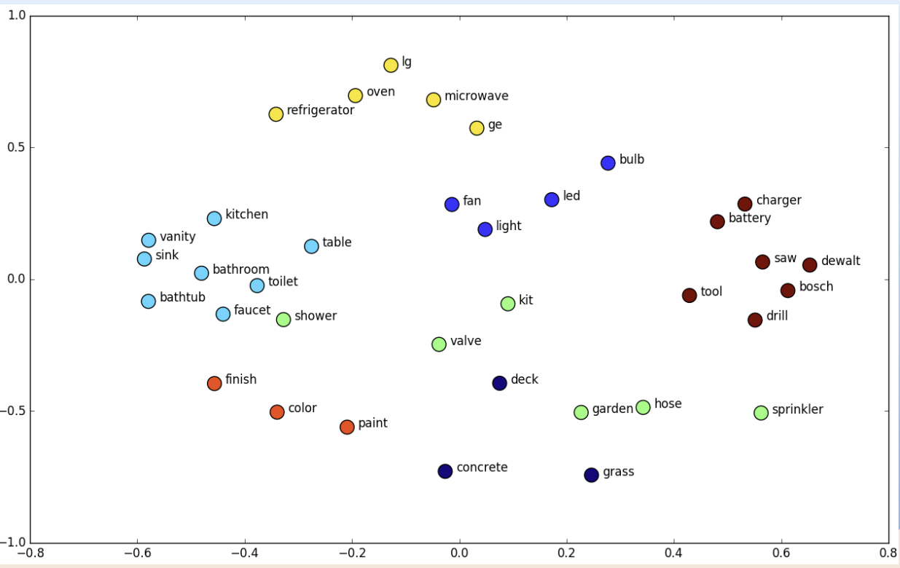</p>

---

**결과 - 모든 것이 완벽하지는 않다 (The Results - Not everything is perfect)**

<p align="center">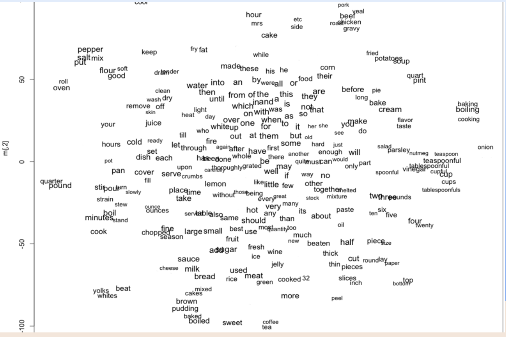</p>

---

**개선 1 (Improvement 1)**

- **아이디어**: 흔한 단어 쌍이나 구(phrase)를 하나의 "단어"로 취급한다.
- 예: Boston Globe(신문)는 Boston과 Globe를 따로 본 것과 다르다. Boston Globe를 하나의 단어/구로 임베딩한다.
- **방법**: 개별 출현 횟수에 비해 함께 자주 나타나는 단어들로 구를 만든다. "and the"나 "this is" 같은 흔한 단어로 구를 만드는 것을 피하기 위해, 드문 단어로 만들어진 구를 선호한다.
- **장단점**: 어휘 크기는 증가하지만 학습 비용은 감소한다.
- **결과**: Google News 데이터셋의 1,000억 단어로 학습된 300만 개의 "단어"로 이어졌다.

---

**개선 2 (Improvement 2)**

- **아이디어**: 빈번한 단어를 서브샘플링(subsample)하여 학습 예시의 수를 줄인다.
  - 단어를 잘라낼 확률은 그 단어의 빈도와 관련이 있다. 더 흔한 단어가 더 많이 잘려나간다.
  - 드문 단어(전체 단어의 0.26% 미만인 것)는 유지된다
  - 예: "the"의 일부 출현을 제거한다.
- **방법**: 각 단어에 대해, 그 단어의 빈도와 관련된 확률로 단어를 잘라낸다.
- **이점**: 윈도우 크기가 10이고, 텍스트에서 "the"의 특정 인스턴스를 제거한다면:
  - 남은 단어들로 학습할 때, "the"는 그들의 문맥 윈도우 어디에도 나타나지 않을 것이다.

---

http://jalammar.github.io/illustrated-word2vec/