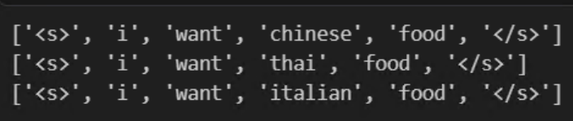
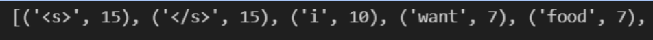
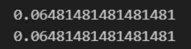
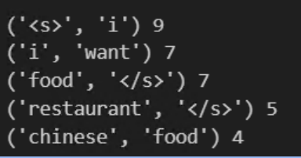
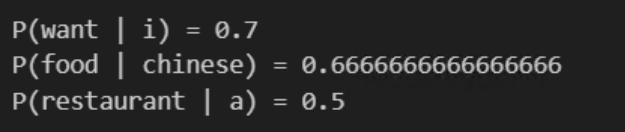
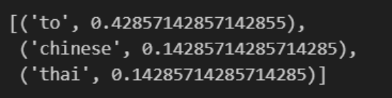
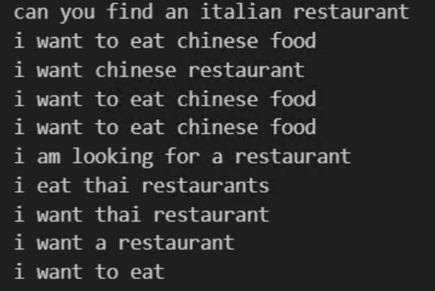
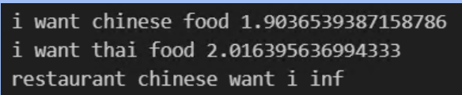

# 실습 2 - N-gram 모델

## 실습 개념 흐름

- 레스토랑 문장
- 토큰화
- 유니그램 / 바이그램 / 트라이그램 빈도
- MLE 확률
- 다음 단어 예측
- 0 확률 문제
- 백오프
- 보간
- 문장 확률
- 퍼플렉서티
- 문장 생성

---

## 작은 버클리 스타일 말뭉치(A Small Berkeley Style Corpus)

- 학생들에게 9,222개 문장 전체를 바로 주기보다는, 10~30개 정도의 문장으로 시작한다.

```python
sentences = [
    "i want chinese food",
    "i want thai food",
    "i want italian food",
    "i want a restaurant",
    "i want to eat",
    "i want to eat chinese food",
    "i want to eat thai food",
    "i am looking for chinese food",
    "i am looking for a restaurant",
    "can you find a chinese restaurant",
    "can you find a thai restaurant",
    "can you find an italian restaurant",
    "tell me about chinese restaurants",
    "tell me about thai restaurants",
    "where can i eat chinese food",
]
```

---

## 문장 경계 추가 (Add Sentence Boundaries)

- 문장 생성을 위해서는 문장이 어떻게 시작(`<s>`)하고 끝(`</s>`)나는지도 학습해야 한다.

```python
def tokenize(sentence):
    return ["<s>"] + sentence.lower().split() + ["</s>"]

corpus = [tokenize(s) for s in sentences]

for sentence in corpus[:3]:
    print(sentence)
```

<p align="center"></p>

---

## 유니그램 빈도 (Unigram Counts)

- $P(w) = C(w)/N$ 을 이해해야 한다.

```python
from collections import Counter

unigram_counts = Counter()

for sentence in corpus:
    unigram_counts.update(sentence)

print(unigram_counts.most_common(10))
```

<p align="center"></p>

```python
total_words = sum(unigram_counts.values())

def unigram_prob(word):
    return unigram_counts[word] / total_words

print(unigram_prob("want"))
print(unigram_prob("food"))
```

<p align="center"></p>

---

## 바이그램 빈도 (Bigram Counts)

- 튜플 자료형이 필요하다.

```python
bigram_counts = Counter()

for sentence in corpus:
    for i in range(len(sentence) - 1):
        bigram = (sentence[i], sentence[i + 1])
        bigram_counts[bigram] += 1

for bigram, count in bigram_counts.most_common(5):
    print(bigram, count)
```

<p align="center"></p>

---

## 바이그램 확률 (Bigram Probability)

- 최대 우도 추정 : $P(w_{i+1} / w_i) = C(w_i, w_{i+1}) / C(w_i)$

```python
def bigram_prob(previous_word, word):
    numerator = bigram_counts[(previous_word, word)]
    denominator = unigram_counts[previous_word]

    if denominator == 0:
        return 0

    return numerator / denominator

print("P(want | i) =", bigram_prob("i", "want"))
print("P(food | chinese) =", bigram_prob("chinese", "food"))
print("P(restaurant | a) =", bigram_prob("a", "restaurant"))
```

<p align="center"></p>

---

## 다음 단어 예측

- 지금까지 n-gram 모델을 학습시켰으니, 이제 테스트해 보자.

```python
def predict_bigram(previous_word, top_k=3):
    candidates = []

    for (w1, w2), count in bigram_counts.items():
        if w1 == previous_word:
            probability = bigram_prob(w1, w2)
            candidates.append((w2, probability))

    return sorted(
        candidates,
        key=lambda x: x[1],
        reverse=True
    )[:top_k]

predict_bigram("want")
```

<p align="center"></p>

---

## 레스토랑 문장 생성

- 모델이 언어를 생성하도록 해 보자.

```python
import random

def sample_next_word(previous_word):
    candidates = []
    weights = []

    for (w1, w2), count in bigram_counts.items():
        if w1 == previous_word:
            candidates.append(w2)
            weights.append(count)

    if not candidates:
        return "</s>"

    return random.choices( # 분포에서 샘플링
        candidates,
        weights=weights,
        k=1
    )[0]
```

```python
def generate_sentence(max_length=15):
    current = "<s>"
    output = []

    for _ in range(max_length):
        next_word = sample_next_word(current)

        if next_word == "</s>":
            break

        output.append(next_word)
        current = next_word

    return " ".join(output)

for _ in range(10):
    print(generate_sentence())
```

<p align="center"></p>

---

## 퍼플렉서티 지표 (Perplexity Metric)

- 로그 확률 사용 : $PP(W) = exp\left(-\frac{1}{N}\sum_i logP(w_i / context)\right)$

```python
import math

def perplexity(sentence):
    tokens = tokenize(sentence)
    log_prob = 0
    n = len(tokens) - 1

    for i in range(n):
        p = bigram_prob(
            tokens[i],
            tokens[i + 1]
        )
        if p == 0:
            return float("inf")
        log_prob += math.log(p)
    return math.exp(-log_prob / n)
```

```python
test_sentences = [
    "i want chinese food",
    "i want thai food",
    "restaurant chinese want i",
]

for s in test_sentences:
    print(
        s,
        perplexity(s)
    )
```

<p align="center"></p>

---

## 트라이그램 확률 (Trigram Probability)

- 최대 우도 추정 : $P(w_{i+2} / w_i, w_{i+1}) = C(w_i, w_{i+1}, w_{i+2}) / C(w_i, w_{i+1})$

```python
trigram_counts = Counter()

for sentence in corpus:
    for i in range(len(sentence) - 2):
        w1, w2, w3 = sentence[i:i+3]
        trigram_counts[(w1, w2, w3)] += 1

def trigram_prob(w1, w2, w3):
    numerator = trigram_counts[(w1, w2, w3)]
    denominator = bigram__counts[(w1, w2)]

    if denominator == 0:
        return 0

    return numerator / denominator

print(trigram_prob("i", "want", "chinese"))
```

---

## 트라이그램 모델로 레스토랑 문장 생성 (Generate Restaurant Sentences with Trigram Model)

- 최대 가능성 추정 : $P(w_{i+2} / w_i, w_{i+1}) = C(w_i, w_{i+1}, w_{i+2}) / C(w_i, w_{i+1})$

이것은 과제 #2이다.