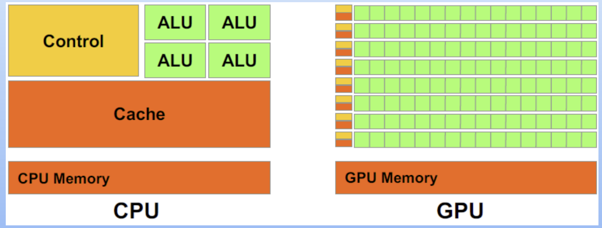
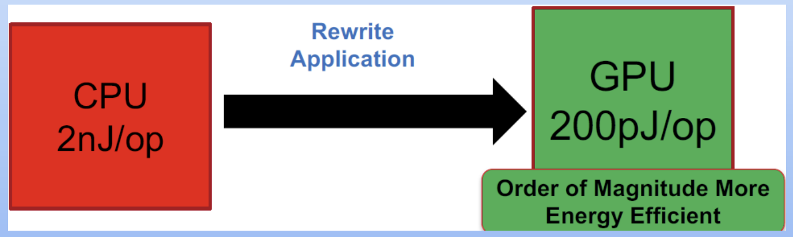
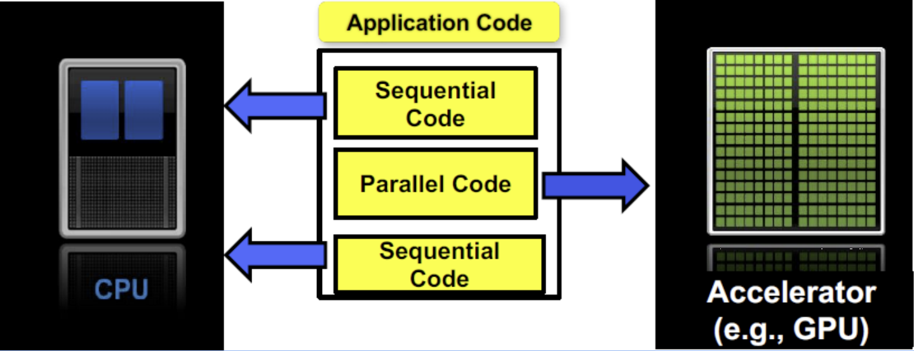
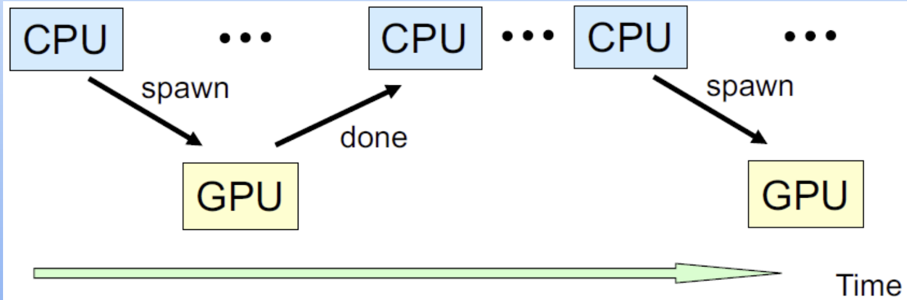
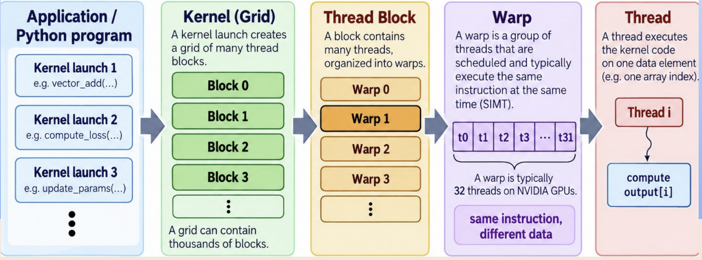
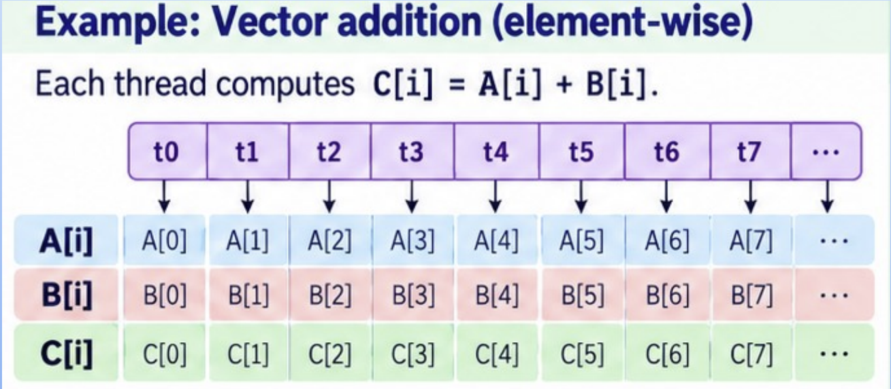
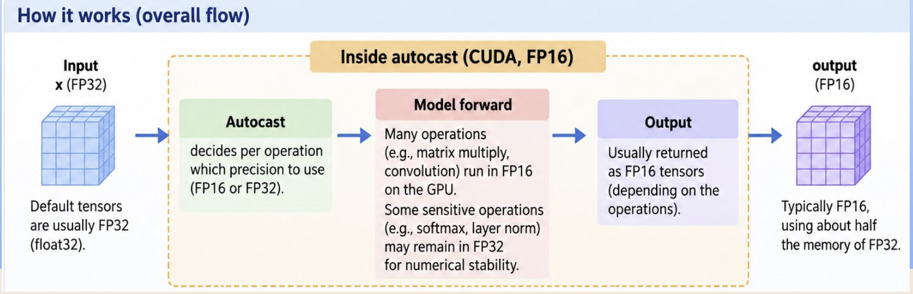
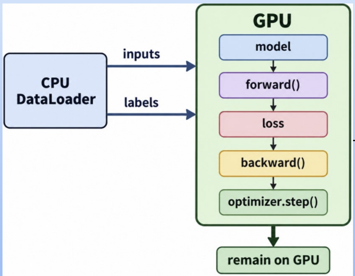
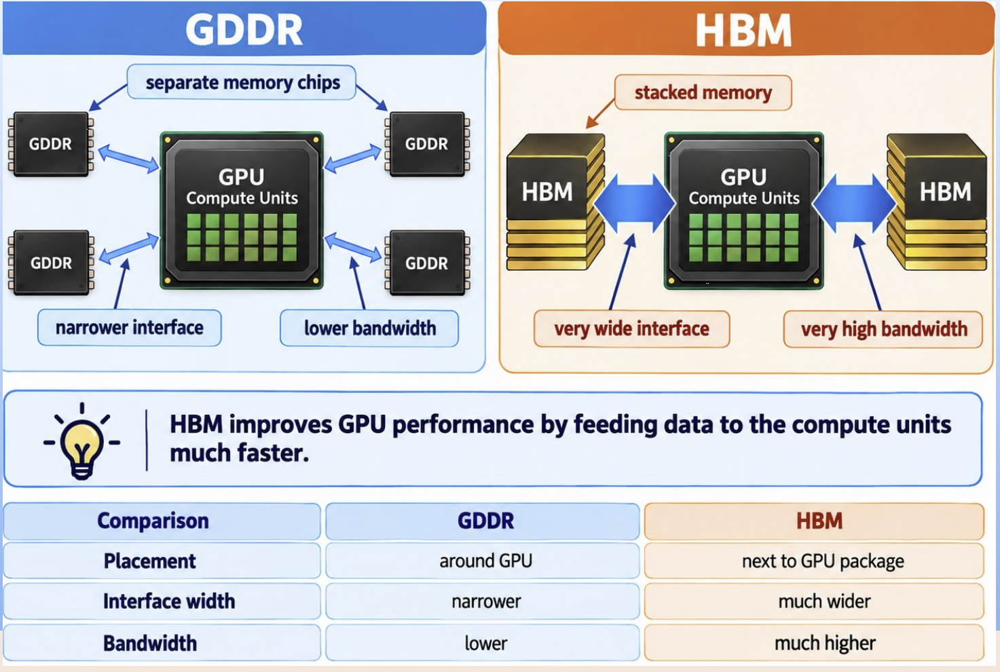
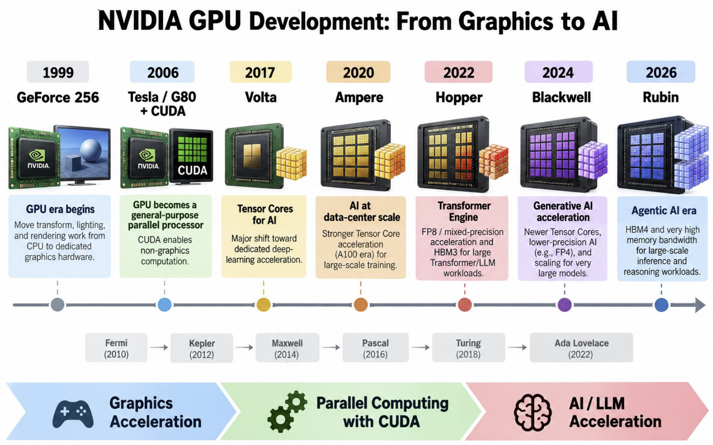

# GPU 기초

## CPU vs GPU vs NPU

### AI의 등장 = 새로운 유형의 컴퓨터 칩

- CPU (중앙 처리 장치, 1960년대)
  - 운영체제와 범용 애플리케이션 실행에 적합

- GPU (그래픽 처리 장치, 1990년대)
  - 그래픽 집약적 애플리케이션, 병렬 처리 및 부동소수점 계산에 적합

- NPU (신경망 처리 장치)
  - 행렬 곱셈과 덧셈이 필요한 AI 및 ML 워크로드에 적합

## CPU : 다재다능

### 강점

- 호환성
  - 사실상 모든 소프트웨어 애플리케이션은 CPU에서 실행되도록 설계되어 있어 기존 시스템과 원활하게 통합할 수 있습니다.

- 범용성
  - 운영체제를 실행하거나 복잡한 알고리즘을 수행하는 경우에도 CPU는 다양한 워크로드를 쉽게 처리할 수 있습니다.

### 약점

- 제한된 병렬성
  - 병렬 작업을 효율적으로 처리하지 못해 병렬 컴퓨팅 상황에서 병목 현상을 발생시킵니다.

- 확장 비용
  - AI 워크로드의 요구사항을 충족하기 위해 CPU 기반 컴퓨팅을 구현하는 것은 특히 대규모 배포에서 지나치게 비쌀 수 있습니다.

## GPU : 병렬 컴퓨팅의 힘

### 강점

- 병렬 처리 능력
  - 병렬 컴퓨팅에 최적화된 수천 개의 ALU 코어를 통해 GPU는 점점 더 사실적인 그래픽을 구현할 수 있습니다. 또한 AI 워크로드를 크게 가속하여 학습 시간을 단축합니다.

- 확장성
  - 여러 GPU의 성능을 병렬로 활용함으로써 조직은 변화하는 요구사항에 맞게 AI 인프라를 원활하게 확장할 수 있습니다.

### 약점

- 특정 사용 사례
  - GPU는 병렬 처리 작업에는 뛰어나지만 순차 또는 단일 스레드 애플리케이션에서는 효율이 떨어질 수 있어 범용성이 제한됩니다.

## NPU : AI 가속기

### 강점

- AI 특화 최적화
  - 신경망의 처리 및 학습을 가속하도록 설계되어 GPU보다 더 나은 성능을 제공합니다.

- 에너지 효율
  - CPU 및 GPU보다 훨씬 적은 전력을 소비하므로 온디바이스 및 IoT 애플리케이션에 적합합니다.

- 엣지 컴퓨팅 기능
  - 낮은 지연 시간과 실시간 데이터 처리

### 약점

- 개발 복잡성
  - NPU용 소프트웨어 애플리케이션을 개발하고 최적화하려면 전문적인 지식과 도구가 필요하며, 이로 인해 개발 비용과 출시까지 걸리는 시간이 증가할 수 있습니다.

- 제한된 범용성
  - 범용 컴퓨팅 작업에는 적합하지 않습니다.

## 개념적 비교

| 특성 | CPU | GPU |
|---|---|---|
| 코어 수 | 적음 | 매우 많음 |
| 코어 복잡도 | 높음 | 비교적 단순함 |
| 순차 처리 | 매우 우수 | 보통 |
| 병렬 처리 | 보통 | 매우 우수 |
| 행렬 연산 | 보통 | 매우 우수 |
| 신경망 | 가능 | 매우 적합 |

## 실리콘 비교

- GPU는 CPU보다 실리콘에서 연산에 사용하는 비율이 더 큽니다.

<p align="center"></p>

## 연산당 에너지 효율

- 최고 성능에서 GPU는 CPU보다 연산당 더 적은 에너지를 사용합니다.

<p align="center"></p>

## GPU의 작동 방식

- 애플리케이션 코드는 순차 코드의 경우 CPU에서 수행되고 병렬 코드의 경우 GPU에서 수행됩니다.

<p align="center"></p>

## GPU 프로그래밍 모델

- CPU(호스트)는 병렬 커널을 GPU(디바이스)로 "오프로딩"합니다.
  - 데이터를 GPU 메모리로 전송
  - GPU가 스레드를 생성
  - 결과 데이터를 다시 CPU의 메인 메모리로 전송해야 함

<p align="center"></p>

- 프로그램은 GPU에서 커널을 실행합니다.
- 커널은 스레드 블록의 그리드로 구성됩니다.
- 각 스레드 블록에는 많은 스레드가 포함됩니다.
- 스레드는 워프(warp)라고 하는 그룹 단위로 스케줄링됩니다.
- 하나의 워프에 있는 스레드들은 일반적으로 서로 다른 데이터에 대해 동일한 명령어를 동시에 실행합니다. (SIMT : 단일 명령 다중 스레드)
- 스레드가 서로 다른 분기로 실행되면 워프 분기로 인해 효율이 감소할 수 있습니다.

<p align="center"></p>

### GPU 프로그래밍 모델 예제

- 각 GPU 스레드는 서로 다른 데이터 요소를 병렬로 처리합니다.
- 예를 들어, 스레드 `t0`는 `C[0] = A[0] + B[0]`을 계산하고, `t1`은 `C[1] = A[1] + B[1]`을 계산합니다.
- 따라서 많은 스레드가 서로 다른 요소에 대해 동일한 덧셈 명령을 동시에 실행합니다.

<p align="center"></p>

## GPU 메모리

```python
x = torch.tensor([1, 2, 3])
```

일반적으로 CPU 메모리에 텐서 `x`를 생성합니다.

```python
x = x.to("cuda")
```

`x`를 GPU vRAM(Video Random Access Memory)으로 복사합니다.

### CPU 시스템 RAM vs. GPU vRAM

vRAM은 여러 주요 구성 요소를 저장합니다.

- 모델 파라미터, 입력 텐서(input tensors), 중간 활성화값(intermediate activations), 그래디언트(gradients), 옵티마이저 상태(optimizer states)
- ___ : 학습 모드용
- 따라서 학습 메모리 > 추론 메모리
- 모델이 텍스트 생성에서는 성공적으로 실행되더라도 파인튜닝 중에는 실패할 수 있습니다.

## CUDA (계산 통합 장치 아키텍처, Computed Unified Device Architecture)

소프트웨어가 GPU를 범용 연산에 사용할 수 있도록 하는 NVIDIA의 컴퓨팅 플랫폼입니다.

```python
c = torch.matmul(a, b)
```

단순한 Python 문장처럼 보입니다.  
하지만 내부적으로는 다음과 같습니다.

PyTorch → CUDA 런타임 → 최적화된 GPU 커널 → 수천 개의 병렬 연산

### 특징 (그래픽에서 범용 연산으로)

- NVIDIA가 개발한 병렬 컴퓨터 아키텍처
- 범용 프로그래밍 모델
  - GPU는 그래픽 연산에 사용됨
- GPGPU(범용 GPU 컴퓨팅)를 위해 특별히 설계됨
- 연산 중심으로 설계된 API 제공
  - DirectX, OpenGL은 그래픽 중심으로 설계된 API를 제공함
  - 범용 컴퓨팅에 사용하기 매우 어려움
- 명시적인 GPU 메모리 관리

## GPU – AI에서 CUDA를 사용하는 이유?

### 딥

- AI 특화 최적화
  - 신경망의 처리 및 학습을 가속하도록 설계되어 GPU보다 더 나은 성능을 제공합니다.

- 에너지 효율
  - CPU 및 GPU보다 훨씬 적은 전력을 소비하므로 온디바이스 및 IoT 애플리케이션에 적합합니다.

- 엣지 컴퓨팅 기능
  - 낮은 지연 시간과 실시간 데이터 처리

## 텐서

### 다차원 배열

**스칼라**

```text
5
shape = []
```

**벡터**

```text
[1, 2, 3]
shape = [3]
```

**행렬**

```text
[[1, 2],
 [3, 4]]

shape = [2, 2]
```

### NLP 모델의 경우

입력 ID

```text
[batch_size, sequence_length]
[32, 128]
```

32개 문장  
×  
문장당 128개 토큰

### LLM의 차원

```text
batch size      = 32
sequence length = 128
embedding dim   = 768
```

```text
토큰 ID
[32,128]
    │
    ▼
┌─────────────┐
│  Embedding  │
└─────────────┘
    │
    ▼
[32,128,768]
```

### `nn.Embedding` 사용

입력 형태 : `[32, 128]` → 출력 형태 : `[32, 128, 256]`

```python
embedding = nn.Embedding(
    vocab_size=10000,
    embedding_dim=256
)
```

## 배치 처리

### 더 큰 배치 크기

- 더 나은 GPU 활용률
- 더 많은 vRAM 필요

### CUDA "메모리 부족"의 경우

1. 배치 크기 줄이기
2. 시퀀스 길이 줄이기
3. FP16/BF16 사용
4. 그래디언트 누적 사용
5. 더 작은 모델 사용

## 수치 정밀도 : FP

전통적인 신경망 연산에서는 다음을 사용합니다.

- FP32 : 32비트 부동소수점 (4 Bytes)

| 접두사 | 기호 | 10의 거듭제곱 | 숫자 | 명칭 |
|---|---|---:|---:|---|
| kilo | K | 10³ | 1,000 | 천 |
| mega | M | 10⁶ | 1,000,000 | 백만 |
| giga | G | 10⁹ | 1,000,000,000 | 십억 |
| tera | T | 10¹² | 1,000,000,000,000 | 일조 |

10억 개의 파라미터를 가진 모델에는 대략 다음이 필요합니다.

- 1B × 4 bytes ~ 4GB vRAM

FP16을 사용하는 경우  
(FP16 : 16비트 부동소수점 (2 Bytes))

- 1B × 2 bytes ~ 2GB vRAM

## 수치 정밀도 : BP

딥러닝 및 LLM 학습에서 널리 사용됩니다.

- BF16 : Brain Floating Point 16-bit (2Bytes)

BF16은 정밀도를 희생하지만 넓은 수치 범위를 유지합니다.

LLM에서는 특히 유용한데, 대략 다음과 같은 이점을 얻을 수 있습니다.

- FP32와 비교했을 때 메모리 사용량이 절반
- 지원되는 GPU에서 더 빠른 행렬 연산
- 많은 경우 FP16보다 더 쉽고 안정적인 학습
- 대부분의 신경망 연산에 충분한 정밀도

| 형식 | 부호 | 지수 | 가수 | 주요 특징 |
|---|---|---|---|---|
| FP32 | 1 bit | 8 bits | 23 bits | 높은 정밀도 |
| BF16 | 1 bit | 8 bits | 7 bits | FP32와 유사한 범위, 더 낮은 정밀도 |
| FP16 | 1 bit | 5 bits | 10 bits | 더 나은 정밀도, 더 작은 범위 |

## 혼합 정밀도

충분한 수치적 안정성을 유지하면서 효율적인 부분에서는 더 낮은 정밀도를 사용합니다.

```python
with torch.autocast(
    device_type="cuda",
    dtype=torch.float16
):
    output = model(x)
```

PyTorch 기본값 = FP32  
`autocast` = 이점이 있는 곳에서 일시적으로 FP16 사용

<p align="center"></p>

---

# PyTorch를 사용한 GPU 프로그래밍

## GPU 확인하기

```python
import torch

print(torch.cuda.is_available())
print(torch.cuda.get_device_name(0))

device = torch.device(
    "cuda" if torch.cuda.is_available()
    else "cpu"
)
```

```text
True
NVIDIA GeForce RTX 4060 Ti
```

디바이스 `"gpu"` 또는 `"cpu"` 선택

## GPU로 이동하기

```python
### 텐서 입력을 GPU로 이동
inputs = torch.randn(1000, 1000)
inputs = inputs.to(device)
print(inputs.device)

### 모델을 GPU로 이동
model = RNNLanguageModel(...)
model = model.to(device)

### 출력 또한 GPU에 있습니다.
### 모델, 입력 텐서 및 연산에 포함된 중간 텐서는 일반적으로 동일한 디바이스에 있어야 하며, 결과 출력도 해당 디바이스에 유지됩니다.
outputs = model(inputs)
print(outputs.device)

### 출력을 다시 CPU로 이동
outputs_cpu = outputs.cpu()
```


## 데이터 이동에는 시간이 소요됨

PCIe (Peripheral Component Interconnect Express)

- CPU/메인보드를 GPU와 같은 장치에 연결하는 고속 연결 방식
- 하지만 데이터가 외부 버스를 통해 이동해야 하기 때문에 GPU 자체 메모리와 비교하면 상대적으로 느립니다.

```python
import torch
import time

device = "cuda"

x = torch.randn(10000, 10000)

# CPU → GPU
torch.cuda.synchronize()
start = time.time()

x_gpu = x.to(device)

torch.cuda.synchronize()
print("CPU → GPU:", time.time() - start)
```

```python
# GPU computation
torch.cuda.synchronize()
start = time.time()

y_gpu = x_gpu * 2

torch.cuda.synchronize()
print("GPU computation:", time.time() - start)

# GPU → CPU
torch.cuda.synchronize()
start = time.time()

y_cpu = y_gpu.cpu()

torch.cuda.synchronize()
print("GPU → CPU:",time.time() - start)
```

모델과 자주 사용하는 텐서는 GPU에 유지합니다. 반복문 내부에서 불필요한 `.cpu()` 및 `.to("cuda")` 연산을 피합니다.

```python
for inputs, labels in loader:
    inputs = inputs.to(device)
    labels = labels.to(device)

    outputs = model(inputs)

    loss = criterion(outputs, labels)

    optimizer.zero_grad()
    loss.backward()
    optimizer.step()
```

<p align="center"></p>

---

# GPU 실습

## #1 : 행렬 곱셈

CUDA 연산은 일반적으로 비동기식입니다. 즉, GPU가 작업을 완료하기 전에 Python이 계속 실행될 수 있습니다.

```text
Without synchronize:
CPU: start ── launch GPU work ── end
GPU: ───────── compute ─────────

With synchronize:
CPU: start ── launch ── wait ─────────────── end
GPU: ───────── compute ─────────
```

```python
import torch
import time

N = 5000

A = torch.randn(N, N)
B = torch.randn(N, N)

start = time.time()

C = torch.matmul(A, B)

print(
    "CPU time:",
    time.time() - start
)
```

```python
A = A.cuda()
B = B.cuda()

torch.cuda.synchronize()
start = time.time()

C = torch.matmul(A, B)

torch.cuda.synchronize()

print(
    "GPU time:",
    time.time() - start
)
```

## #2 : vRAM 관찰

GPU 메모리 확인

```python
print(
    torch.cuda.memory_allocated()
    / 1024**2, "MB"
)
```

큰 텐서 생성

```python
x = torch.randn(
    10000,
    10000,
    device="cuda"
)
```

다시 확인

```python
print(
    torch.cuda.memory_allocated()
    / 1024**2, "MB"
)
```

이로 인해 `"CUDA out of memory"` 오류가 발생할 수 있습니다.

## #3 : 정밀도 & 메모리

FP32 데이터

```python
x32 = torch.randn(
    5000,
    5000,
    device="cuda",
    dtype=torch.float32
)

memory32 = (
    x32.element_size()
    * x32.nelement()
)

print(memory32 / 1024**2, "MB")
```

FP16 데이터

```python
x16 = torch.randn(
    5000,
    5000,
    device="cuda",
    dtype=torch.float16
)

memory16 = (
    x16.element_size()
    * x16.nelement()
)

print(memory16 / 1024**2, "MB")
```

# GPU 성능 요소

## 연산 성능

- 수학적 연산을 얼마나 빠르게 수행할 수 있는지를 결정합니다.

## VRAM

- 대략 어느 정도 크기의 모델, 배치 및 시퀀스를 담을 수 있는지를 결정합니다.

## 메모리 대역폭

- GPU 메모리와 연산 장치 사이에서 데이터를 얼마나 빠르게 이동시킬 수 있는지를 결정합니다.

## CPU–GPU 전송

- 데이터가 RAM과 VRAM 사이를 계속 이동하면 병목 현상이 될 수 있습니다.

# 연산 제한 vs. 메모리 제한

## 연산 제한

- GPU가 산술 연산을 수행하느라 바쁜 상태입니다.

## 메모리 제한

- GPU가 메모리에서 데이터가 도착하기를 기다리는 상태입니다.

| 연산 | 주요 활동 | 속도를 제한하는 요소 | 일반적인 동작 |
|---|---|---|---|
| `A + B` | 두 값을 읽고, 한 번 더한 후, 하나의 값을 기록 | 메모리 대역폭 | 메모리 제한 |
| `A @ B` | 많은 곱셈-덧셈 연산 수행 | GPU 연산 능력 | 연산 제한 |
| LLM 학습 | 많은 토큰에 대해 대규모 행렬 연산 | 주로 GPU 연산 | 더 연산 제한적 |
| LLM 추론, `batch = 1` | 토큰을 생성하기 위해 큰 모델 가중치를 반복해서 읽음 | 주로 GPU 메모리 대역폭 | 더 메모리 제한적 |

# GPU 성능을 위한 HBM

<p align="center"></p>

<p align="center"></p>