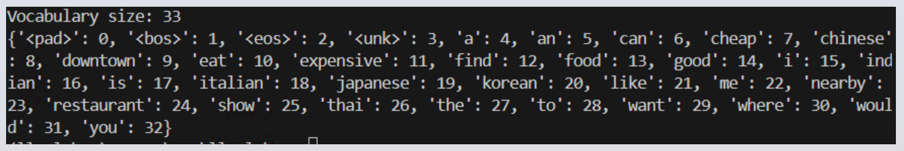
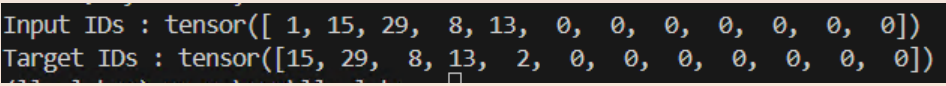
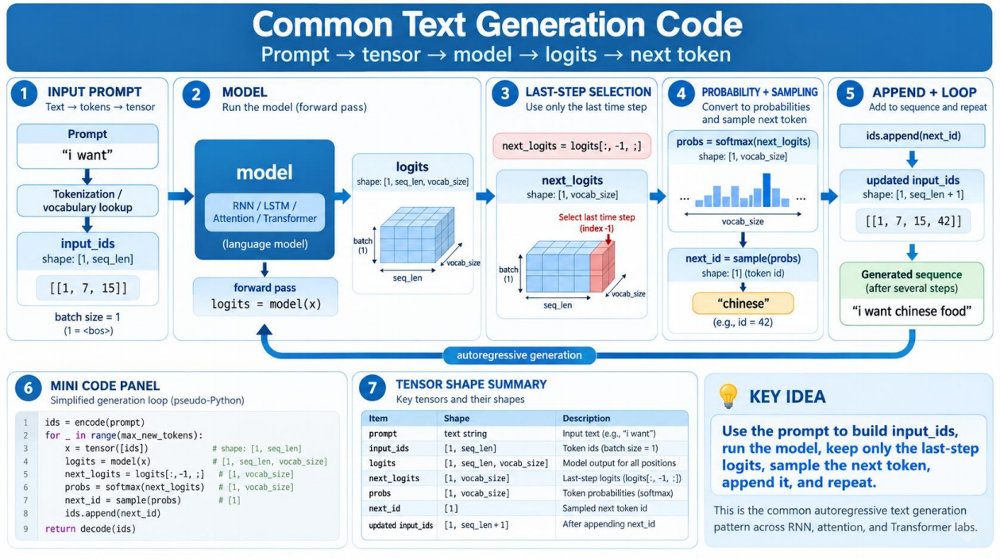
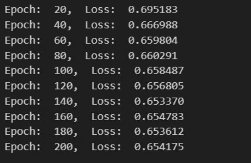
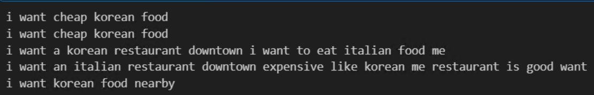
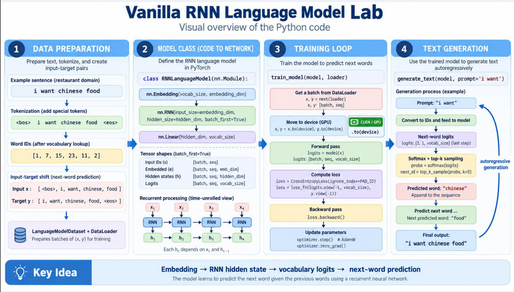
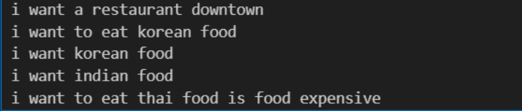

# 실습 4 - RNN

## 실습 개념 흐름

- N-그램
- Word2Vec
- 바닐라 RNN
- LSTM
- 싱글 헤드 셀프 어텐션
- 기본 Transformer
- Hugging Face / 최신 LLM

## 공통 설정

- GPU 설정
- 샘플 레스토랑 코퍼스
- 어휘 구축
- 다음 단어 학습 데이터 준비
- 모델 학습
- 텍스트 생성 함수

## GPU 설정

- CUDA를 사용합니다.

```python
import torch
import torch.nn as nn
import torch.nn.functional as F

from torch.utils.data import Dataset, DataLoader

device = torch.device(
    "cuda" if torch.cuda.is_available() else "cpu"
)

print("Device:", device)

if torch.cuda.is_available():
    print("GPU:", torch.cuda.get_device_name(0))

torch.manual_seed(42)
```

`torch.device`는 텐서나 신경망 모델이 할당되고 실행될 컴퓨팅 하드웨어(CPU 또는 특정 GPU 등)를 지정하는 데 사용되는 PyTorch 클래스입니다.

`torch.manual_seed(42)`는 난수 생성기의 시드를 특정 값(42)으로 고정합니다.

무작위성으로 인해 발생하는 변동을 제거하여 변경 사항의 영향을 분리하고 정확하게 측정할 수 있도록 합니다.

## 샘플 레스토랑 코퍼스 1

```python
sentences = [
    "i want chinese food",
    "i want korean food",
    "i want italian food",
    "i want japanese food",
    "i want thai food",
    "i want indian food",

    "i want a chinese restaurant",
    "i want a korean restaurant",
    "i want an italian restaurant",
    "i want a japanese restaurant",

    "i want to eat chinese food",
    "i want to eat korean food",
    "i want to eat italian food",
    "i want to eat japanese food",

    "i would like chinese food",
    "i would like korean food",
    "i would like italian food",
    "i would like japanese food",

    "find a chinese restaurant",
    "find a korean restaurant",
    "find an italian restaurant",
    "find a japanese restaurant",

    "show me a chinese restaurant",
    "show me a korean restaurant",
    "show me an italian restaurant",
    "show me a japanese restaurant",

    "can you find a chinese restaurant",
    "can you find a korean restaurant",
    "can you find an italian restaurant",
    "can you find a japanese restaurant",

    "where can i eat chinese food",
    "where can i eat korean food",
    "where can i eat italian food",
    "where can i eat japanese food",
```

## 샘플 레스토랑 코퍼스 2

```python
    "i want cheap chinese food",
    "i want cheap korean food",
    "i want expensive italian food",

    "find a cheap restaurant",
    "find a good restaurant",
    "find a nearby restaurant",

    "i want a restaurant downtown",
    "i want a restaurant nearby",
    "show me a restaurant downtown",

    "the chinese restaurant is good",
    "the korean restaurant is good",
    "the italian restaurant is expensive",
    "the thai restaurant is cheap",
]
```

## 어휘 구축

- `"i want Chinese food"` → `<BOS> i want Chinese food <EOS>` → `[1, 15, 32, 8, 13, 2]`

```python
SPECIAL_TOKENS = [
    "<pad>",
    "<bos>",
    "<eos>",
    "<unk>"
]

words = []

for sentence in sentences:
    words.extend(
        sentence.lower().split()
    )

vocab = SPECIAL_TOKENS + sorted(
    set(words)
)
```

```python
word_to_id = {
    word: i
    for i, word in enumerate(vocab)
}

id_to_word = {
    i: word
    for word, i in word_to_id.items()
}

PAD_ID = word_to_id["<pad>"]
BOS_ID = word_to_id["<bos>"]
EOS_ID = word_to_id["<eos>"]
UNK_ID = word_to_id["<unk>"]

vocab_size = len(vocab)

print("Vocabulary size:", vocab_size)
print(word_to_id)
```

<p align="center"></p>

## 다음 단어 학습 데이터 준비

- 입력: `<BOS> i want chinese food`
- 타깃: `i want chinese food <EOS>`

```python
MAX_LEN = 12

class LanguageModelDataset(Dataset):
    def __init__(self, sentences):
        self.examples = []

        for sentence in sentences:
            tokens = sentence.lower().split()
            ids = [BOS_ID]

            for word in tokens:
                ids.append(
                    word_to_id.get(
                        word,
                        UNK_ID
                    )
                )

            ids.append(EOS_ID)

            # Input
            x = ids[:-1]

            # Next-word targets
            y = ids[1:]

            x = x[:MAX_LEN]
            y = y[:MAX_LEN]

            padding = MAX_LEN - len(x)

            x = x + [PAD_ID] * padding
            y = y + [PAD_ID] * padding

            self.examples.append(
                (
                    torch.tensor(
                        x,
                        dtype=torch.long
                    ),
                    torch.tensor(
                        y,
                        dtype=torch.long
                    )
                )
            )
```

`torch.tensor()`는 GPU에서 실행하고 그래디언트를 추적하기 위해 Python 리스트, 튜플 또는 NumPy 배열과 같은 데이터로부터 텐서를 생성합니다.

- 입력: `<BOS> i want chinese food`
- 타깃: `i want chinese food <EOS>`

```python
    def __len__(self):
        return len(self.examples)

    def __getitem__(self, index):
        return self.examples[index]
```

`Dataset`: 데이터 샘플과 그에 대응하는 레이블을 저장합니다.

`DataLoader`: Dataset을 감싸 반복 가능한 접근을 제공하며, 배치 처리, 셔플, 멀티프로세싱을 사용한 병렬 데이터 로딩을 가능하게 합니다.

```python
dataset = LanguageModelDataset(
    sentences
)

loader = DataLoader(
    dataset,
    batch_size=16,
    shuffle=True
)

x, y = dataset[0]

print("Input IDs :", x)
print("Target IDs:", y)
```

<p align="center"></p>

## 모델 학습 1

```python
def train_model(
    model,
    loader,
    epochs=200,
    learning_rate=0.003
):
    model = model.to(device)

    criterion = nn.CrossEntropyLoss(
        ignore_index=PAD_ID
    )

    optimizer = torch.optim.AdamW(
        model.parameters(),
        lr=learning_rate
    )

    model.train()
```

**Adam: 표준 Adam(L2 정규화)**

Weight decay는 L2 페널티를 손실 함수에 직접 추가하는 방식으로 구현됩니다.

문제점: Adam은 적응형 학습률을 사용하므로, 즉 과거 그래디언트의 이동 평균으로 업데이트를 나누므로, 그래디언트 계산에 weight decay 페널티를 추가하면 이러한 적응형 학습률이 변경됩니다.

AdamW는 weight decay 단계를 그래디언트 업데이트 계산에서 분리함으로써 이 문제를 해결합니다. Adam은 순수하게 손실 그래디언트만을 기반으로 적응형 모멘텀과 스케일링 단계를 계산합니다. 그런 다음 마지막에 별도의 감소 단계로 weight decay가 가중치에 직접 적용됩니다.

`model.train()`은 신경망과 그 안의 모든 하위 모듈을 학습 모드로 설정합니다.

## 모델 학습 2

로짓의 차원:

```text
(batch_size, MAX_LEN, vocab_size)
```

`reshape(-1, vocab_size)`는 처음 두 차원을 하나의 차원으로 평탄화합니다. `-1`은 PyTorch가 해당 크기를 자동으로 계산하도록 합니다.

```text
(batch_size * MAX_LEN, vocab_size)
```

`reshape(-1)`:

```text
(batch_size, MAX_LEN)
→ (batch_size * MAX_LEN)
```

예:

`y`는 다음을 나타냅니다.

```text
"위치 (0, 3)에서 올바른 토큰 ID는 55이다." (2D)
```

`logits`는 다음을 나타냅니다.

```text
"위치 (0, 3)에서 사전에 있는 32개 모든 단어에 대한 내 예측값이다." (3D)
```

```python
    for epoch in range(epochs):
        total_loss = 0

        for x, y in loader:
            x = x.to(device)
            y = y.to(device)

            optimizer.zero_grad()

            logits = model(x)

            loss = criterion(
                logits.reshape(
                    -1,
                    vocab_size
                ),
                y.reshape(-1)
            )

            loss.backward()
            optimizer.step()

            total_loss += loss.item()

        if (epoch + 1) % 20 == 0:
            average_loss=(total_loss/len(loader))

            print(f"Epoch: {epoch+1:3d}, Loss: "
                  f"{average_loss:.4f}")
```

`loss.item()`은 하나의 원소로 이루어진 PyTorch 텐서에서 일반 Python `float` 값을 추출합니다.

학습 루프 안에서 loss를 출력할 때 `.item()`을 사용하지 않으면 해당 히스토리를 계속 유지하여 메모리 누수(GPU 메모리 부족)를 발생시킵니다.

## 텍스트 생성 1

```python
def generate_text(
    model,
    prompt="i want",
    max_new_tokens=12,
    temperature=0.8,
    top_k=3,
):
    model.eval()

    prompt_words = (
        prompt.lower().split()
        if prompt
        else []
    )

    ids = [BOS_ID]

    for word in prompt_words:
        ids.append(
            word_to_id.get(
                word, UNK_ID
            )
        )
```

`model.eval()`은 PyTorch 신경망을 평가 모드로 전환합니다.

Dropout 계층의 무작위성을 비활성화하고, BatchNorm 계층에서 배치 통계 대신 누적된 평균/분산 통계를 사용합니다.

권장 방식: 추론/테스트 중에는 항상 `torch.no_grad()`와 함께 사용합니다.

딕셔너리에 대응하는 값이 없으면 `UNK_ID`가 반환됩니다.

## 텍스트 생성 2

```python
    with torch.no_grad():
        for _ in range(max_new_tokens):
            context = ids[-MAX_LEN:]

            x = torch.tensor(
                context,
                dtype=torch.long,
                device=device,
            )

            logits = model(x)

            # prediction from last position
            next_logits = logits[0,-1]

            next_logits = next_logits / temperature
```

다음 단어를 예측할 때 `MAX_LEN`개의 토큰만 사용됩니다.

RNN은 hidden state를 기억하거나, 모든 context를 다시 계산하여 이를 잊습니다.

context 크기:

```text
[batch_size (1), MAX_LEN]
```

`with torch.no_grad()`는 그래디언트 계산을 비활성화하는 context manager입니다.

왜 사용하는가? 모델을 평가, 테스트 또는 추론할 때는 가중치를 업데이트하지 않으며(backpropagation 없음), 따라서 그래디언트를 추적할 필요가 없습니다.

장점: 메모리 사용량을 크게 줄이고 계산 속도를 높입니다.

마지막(다음) 단어만 필요합니다.

```text
Temperature < 1 → 더 뾰족한 확률 분포 → 더 안전함 / 더 예측 가능함
Temperature > 1 → 더 평평한 확률 분포 → 더 무작위적인 생성
```

## 텍스트 생성 3

```python
            # Top-k sampling
            if top_k is not None:
                values, indices = torch.topk(
                    next_logits, top_k
                )

                probabilities = F.softmax(
                    values, dim=-1
                )

                sampled_index = torch.multinomial(
                    probabilities, 1
                )

                next_id = indices[sampled_index].item()

            else:
                probabilities = F.softmax(
                    next_logits, dim=-1
                )

                next_id = torch.multinomial(
                    probabilities, 1
                ).item()
```

전체 어휘에서 샘플링하는 대신 로짓이 가장 큰 `k(5)`개의 토큰에서 샘플링합니다.

| 토큰 | logit | 토큰 ID | 확률 |
|---|---:|---:|---:|
| eat | 6.1 | 23 | 0.36 |
| drink | 5.7 | 91 | 0.24 |
| have | 5.3 | 42 | 0.16 |
| order | 4.9 | 105 | 0.13 |
| get | 4.6 | 18 | 0.11 |

주어진 확률 텐서를 기반으로 다항 분포에서 무작위 샘플을 추출합니다.

`num_samples`: 추출할 독립적인 샘플의 수입니다.

`replacement`: Boolean 값입니다.

## 텍스트 생성 4

```python
            if next_id == EOS_ID:
                break

            ids.append(next_id)

    generated_words = []

    for token_id in ids:
        word = id_to_word[token_id]

        if word not in SPECIAL_TOKENS:
            generated_words.append(word)

    return " ".join(generated_words)
```

특수 토큰을 제거합니다.

## 공통 텍스트 생성 코드

<p align="center"></p>

## 바닐라 RNN 언어 모델

- 단어 ID
- 임베딩
- `x₁ → RNN → h₁`
- `x₂ → RNN → h₂`
- `x₃ → RNN → h₃`
- 선형 계층
- 어휘 로짓
- 다음 단어

## RNN 언어 모델 1

```python
class RNNLanguageModel(nn.Module):
    def __init__(
        self,
        vocab_size,
        embedding_dim=64,
        hidden_dim=128
    ):
        super().__init__()

        self.embedding = nn.Embedding(
            vocab_size,
            embedding_dim,
            padding_idx=PAD_ID
        )

        self.rnn = nn.RNN(
            input_size=embedding_dim,
            hidden_size=hidden_dim,
            batch_first=True
        )

        self.output = nn.Linear(
            hidden_dim,
            vocab_size
        )
```

이산적인 정수 단어 인덱스를 학습된 벡터로 매핑합니다.  
(cf. Word2Vec)

`padding_idx=PAD_ID`: 하나의 배치에 포함된 모든 입력이 동일한 길이를 가지도록 더 짧은 시퀀스를 패딩할 때 사용되는 정수 인덱스를 지정합니다.

시간 순서에 따라 단어 벡터를 순차적으로 처리하면서 hidden state를 업데이트하여 이전 토큰의 문맥 정보를 포착합니다.

`batch_first=True`: 텐서의 형태를 다음과 같이 변경합니다.

```text
(sequence_length, batch_size, embedding dimension)
→
(batch_size, sequence_length, embedding dimension)
```

RNN 계층의 hidden state를 다시 어휘 공간으로 투영하여 사전에 있는 모든 가능한 단어에 대한 원시 점수(logits)를 출력합니다.

## RNN 언어 모델 2

```python
def forward(self, x):
    # x:
    # [batch, sequence]

    embedded = self.embedding(x)

    # embedded:
    # [batch, sequence, embedding_dim]

    hidden_states, hidden = self.rnn(
        embedded
    )

    # hidden_states:
    # [batch, sequence, hidden_dim]

    logits = self.output(
        hidden_states
    )

    # logits:
    # [batch, sequence, vocab_size]

    return logits
```

`hidden_states`: 모든 time step에 대한 hidden state입니다.

형태:

```text
(batch_size, sequence_length, hidden_size)
```

`batch_first=True`인 경우입니다.

`hidden`: 마지막 time step의 최종 hidden state입니다.

형태:

```text
(num_layers * num_directions, batch_size, hidden_size)
```

## RNN 언어 모델 - hidden state 재사용 버전

```python
def forward(self, x, hidden=None):
    # x:
    # [batch, sequence]

    embedded = self.embedding(x)

    # embedded:
    # [batch, sequence, embedding_dim]

    hidden_states, hidden = self.rnn(
        embedded, hidden
    )

    # hidden_states:
    # [batch, sequence, hidden_dim]

    logits = self.output(
        hidden_states
    )

    # logits:
    # [batch, sequence, vocab_size]

    return logits, hidden
```

`hidden_states`: 모든 time step에 대한 hidden state입니다.

형태:

```text
(batch_size, sequence_length, hidden_size)
```

`batch_first=True`인 경우입니다.

`hidden`: 마지막 time step의 최종 hidden state입니다.

형태:

```text
(num_layers * num_directions, batch_size, hidden_size)
```

텍스트 생성 코드에서:

```python
# In the Text Generation code
logits, hidden = model(x, hidden)
```

## 학습

- `common.py`의 `train_model()`을 호출해야 합니다.

```python
train_model(
    rnn_model,
    loader
):
```

<p align="center"></p>

## RNN 언어 모델을 사용한 텍스트 생성

- `generate_text` 메서드를 호출하면 됩니다.

```python
for _ in range(5):
    print(
        generate_text(
            rnn_model,
            prompt="i want"
        )
    )
```

<p align="center"></p>

## 바닐라 RNN 언어 모델 실습

<p align="center"></p>

## LSTM 언어 모델

- 동일한 코퍼스
- 동일한 어휘
- 동일한 Dataset
- 동일한 DataLoader
- 동일한 loss
- 동일한 GPU
- 동일한 생성 함수
- RNN → LSTM 모듈만 변경

## LSTM 언어 모델 1

```python
class LSTMLanguageModel(nn.Module):
    def __init__(
        self,
        vocab_size,
        embedding_dim=64,
        hidden_dim=128
    ):
        super().__init__()

        self.embedding = nn.Embedding(
            vocab_size,
            embedding_dim,
            padding_idx=PAD_ID
        )

        self.lstm = nn.LSTM(
            input_size=embedding_dim,
            hidden_size=hidden_dim,
            batch_first=True
        )

        self.output = nn.Linear(
            hidden_dim,
            vocab_size
        )

    def forward(self, x):
        embedded = self.embedding(x)

        hidden_states, (h, c) = self.lstm(
            embedded
        )

        logits = self.output(
            hidden_states
        )

        return logits
```

## LSTM 언어 모델 2

```python
lstm_model = LSTMLanguageModel(
    cm.vocab_size,
).to(cm.device)

cm.train_model(
    lstm_model,
    cm.loader,
    epochs=300,
)

for _ in range(5):
    print(cm.generate_text(
        lstm_model,
        prompt="i want",
        temperature=5,
        top_k=5,
    ))
```

<p align="center"></p>